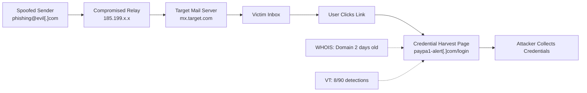
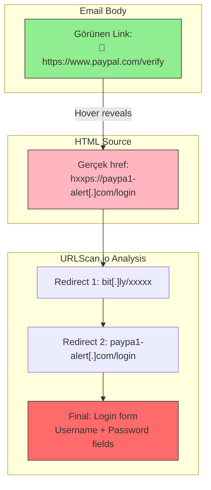
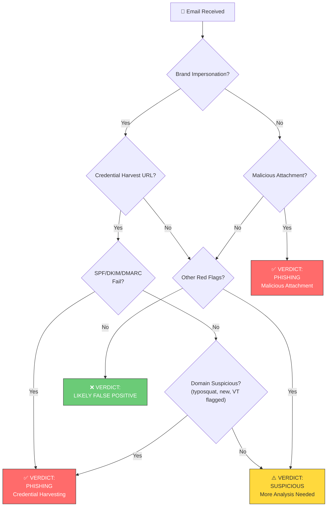
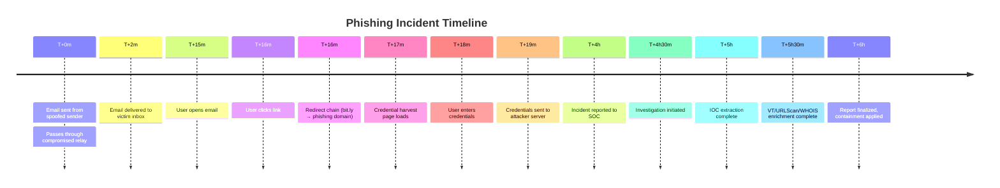
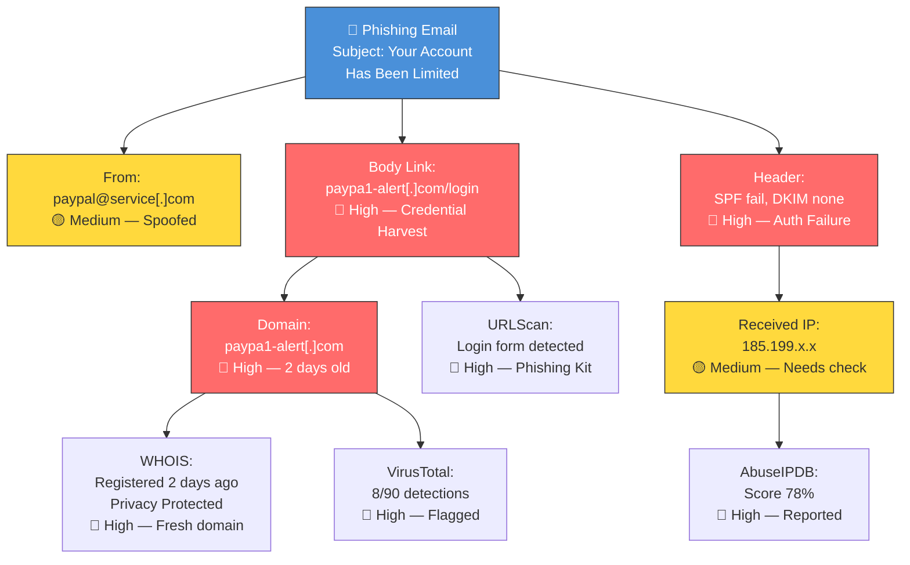
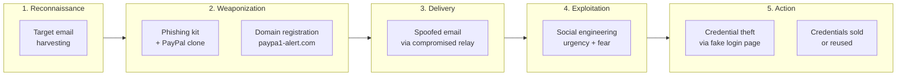

# Görsel Örnekler — Raporuna Ekleyebileceğin Mermaid Diyagramları

Bu dosyadaki diyagramları `reports/phishing_investigation_report_CASE1_FINAL.md` raporuna kopyalayıp kendi bulgularınla doldur.

---

## 1. Mail Akış Diyagramı (Email Route)

---

## 2. Link Mismatch — Görünen vs Gerçek

---

## 3. Verdict Karar Ağacı

---

## 4. Timeline (Zaman Çizelgesi)

---

## 5. IOC Relationship Map

---

## 6. Saldırı Zinciri (Attack Chain)

---

## Nasıl Kullanılır?

1. Bu diyagramlardan senin vakana uygun olanı seç
2. `[ ]` içindeki placeholder'ları kendi bulgularınla değiştir
3. Raporunun ilgili bölümüne kopyala
4. GitHub/GitLab'da `.md` olarak görüntülendiğinde Mermaid otomatik render edilir

**Mermaid live editor:** https://mermaid.live/ — diyagramları burada test edebilirsin.
