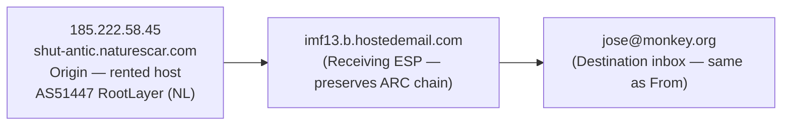
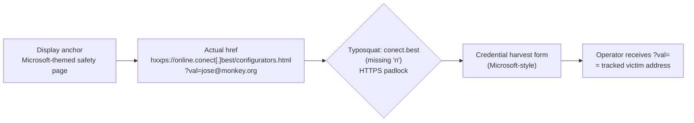
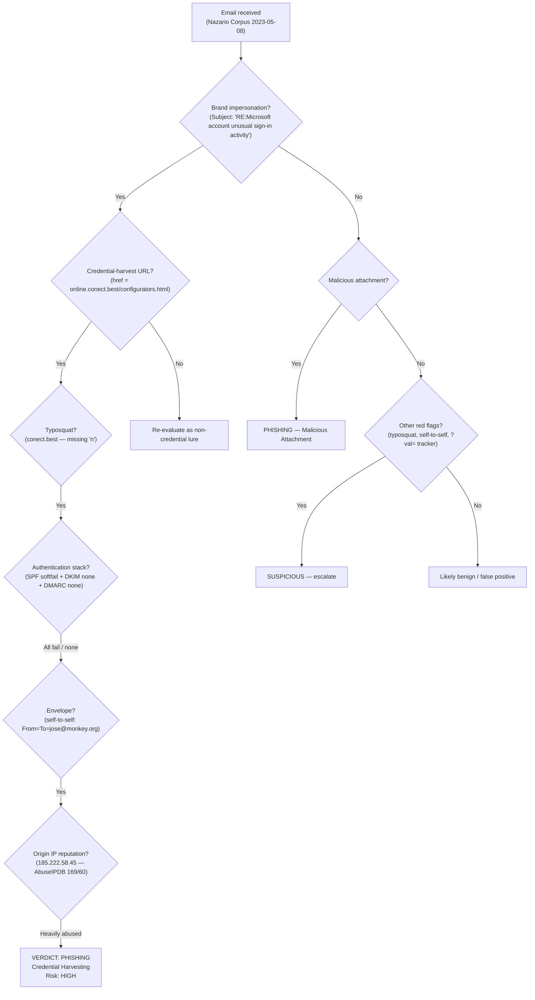

# Phishing Investigation Report

**Report ID:** PHISH-2026-002
**Date:** 2026-06-17
**Analyst:** KBugra
**Classification:** TLP:CLEAR — Public Educational Lab Report

---

## 1. Executive Summary

This report documents the analysis of a Microsoft-branded phishing email captured in the Nazario Phishing Corpus sample `phishing-2023` (index 97). The message impersonates a Microsoft "unusual sign-in activity" security alert and lures the recipient to a credential-harvesting landing page hosted on a typosquatted domain (`conect[.]best` — missing the letter `n`). Delivery originated from a rented-hosting IP in the Netherlands (`185.222.58.45`, AS51447 RootLayer Web Services) that has accumulated 169 abuse reports across 60 sources, and the message scored `9.50` on Rspamd. The email is a self-to-self attack (From and To both `jose@monkey[.]org`), the Message-ID is forged to look like it originated inside `monkey[.]org`, and the link contains a `?val=jose@monkey.org` parameter that the operator uses to track which victim clicked. Brand impersonation, display/href URL mismatch, typosquatting, self-to-self envelope, and a complete absence of SPF / DKIM / DMARC authentication together constitute a textbook credential-harvesting phishing campaign consistent with 2023-era Microsoft lures.

- **Verdict:** Phishing — Credential Harvesting
- **Risk Level:** High
- **Summary:** Unsolicited Microsoft impersonation email delivering a credential-harvesting URL (`hxxps://online.conect[.]best/configurators.html?val=jose@monkey.org`) via a typosquatted domain and an abused rented-hosting IP. The message exhibits every major 2023-era phishing indicator (typosquatting, self-to-self envelope, fabricated Message-ID, no SPF/DKIM/DMARC, victim-tracking parameter, ARC chain from a permissive ESP). User credential loss is the primary impact; Microsoft account takeover, downstream MFA bypass, OAuth-consent fraud, and password-reuse lateral movement are credible second-order risks.

---

## 2. Case Information

| Field | Value |
|-------|-------|
| **Report Date** | 2026-06-17 |
| **Analyst** | KBugra |
| **Source** | Nazario Phishing Corpus — `phishing-2023` (index 97) |
| **Email Subject** | `RE:Microsoft account unusual sign-in activity` |
| **Sender (From)** | `Mail Delivery System <jose@monkey[.]org>` |
| **Recipient (To)** | `jose@monkey[.]org` (self-to-self) |
| **Date Sent** | Mon, 8 May 2023 20:49:11 +0200 |
| **Date Received** | Mon, 8 May 2023 18:49:12 UTC |
| **Email File** | `case2_microsoft.eml` |

---

## 3. Email Header Analysis

### 3.1 Key Header Fields

| Header | Value | Notes |
|--------|-------|-------|
| From | `Mail Delivery System <jose@monkey[.]org>` | Display name claims to be a "Mail Delivery System" — a *display* impersonation, not a brand impersonation. The actual sender domain `monkey.org` is unrelated to Microsoft. |
| To | `jose@monkey[.]org` | **Self-to-self envelope** — From and To are the same mailbox. This is a structural oddity that no legitimate notification flow produces. |
| Subject | `RE:Microsoft account unusual sign-in activity` | `RE:` prefix is a **reply-chain hijack** — implies the recipient is responding to an earlier thread that never actually existed. The body is a first-contact lure, not a reply. |
| Message-ID | `<20230508204911.C853EA17CE7994C1@monkey.org>` | **Critical:** the domain portion claims `monkey.org`, but the email did not originate from `monkey.org`'s infrastructure — the sending IP `185.222.58.45` (naturescar[.]com) is unrelated. The Message-ID is **forged** to look like a `monkey.org` internal post. |
| ARC chain | `ARC-Seal`, `ARC-Authentication-Results`, `ARC-Message-Signature` from `hostedemail.com` | The receiving ESP preserved an ARC chain, but ARC only attests to *what the previous hop said* — it does not authenticate the original sender. |
| X-Spam-Status | `Yes, score=9.50 required=5.0` (Rspamd) | Score ~1.9× the threshold. Lower than Case 1 (22.4) because the 2023 lure uses HTTPS and professional formatting, which defeats several legacy content rules. |
| X-Mailer | Not present | Modern professional phishing kits deliberately omit `X-Mailer` to avoid signature-based detection. The *absence* of an `X-Mailer` is itself an indicator of a 2023-era kit. |

### 3.2 Authentication Results

| Mechanism | Result | Interpretation |
|-----------|--------|----------------|
| SPF | **softfail** — `185.222.58.45 is neither permitted nor denied by domain of monkey.org` | The `monkey.org` policy is `~all` (softfail). The sending IP is not in the SPF allow-list, but the policy does not hard-fail. Receiving MTAs that honor `~all` should mark the message as suspicious; MTAs that treat `~all` as informational will deliver. |
| DKIM | **none** | No DKIM signature on the message. Body and header integrity are not verified. |
| DMARC | **none** | No DMARC policy is published for `monkey.org`. Even if SPF and DKIM had both failed, there is no domain-level instruction to reject or quarantine. The receiving MTA is operationally required to deliver. |

**Analyst note:** The authentication stack is "softfail + none + none" — a **triple absence of enforcement**. The `~all` SPF policy signals the domain owner's *intent* to be suspicious, but the missing DMARC policy converts that intent into a non-action. This is the structural failure mode that allows the impersonation to land in the inbox.

### 3.3 Received Chain Analysis

```
Received: from shut-antic.naturescar.com ([185.222.58.45])
        by imf13.b.hostedemail.com
        ...
        for <jose@monkey.org>; Mon, 08 May 2023 18:49:12 +0000
```

**Route Summary (read bottom-to-top):**



**Findings:**
- **Hop 1 (bottom — origin):** `shut-antic.naturescar.com [185.222.58.45]` — a hostname on the `naturescar[.]com` domain (the EHLO name the attacker chose) resolving to a rented-hosting IP at RootLayer Web Services in the Netherlands. **At the time of analysis**, this IP has 169 abuse reports on AbuseIPDB (Email Spam, Brute-Force, Unauthorized SMTP) across 60 distinct sources.
- **Hop 2 (delivery):** `imf13.b.hostedemail.com` — the receiving ESP (hostedemail.com) accepted the message from `185.222.58.45` over a single SMTP hop. The ESP preserved an ARC chain (ARC-Seal, ARC-Authentication-Results, ARC-Message-Signature), attesting only to its *own* handling — not to the original sender's identity.
- **Hop 3 (inbox):** `jose@monkey[.]org` — final delivery into the recipient mailbox. The mailbox is the **same as the From address**, confirming the self-to-self envelope.

### 3.4 Visual Evidence

| Screenshot | Reference |
|------------|-----------|
| Raw Header | `screenshots/01_raw_header.png` |
| Header Parser Output | `screenshots/02_header_parser.png` |
| Authentication-Results Block | `screenshots/02b_auth_results.png` |

---

## 4. Content Analysis

### 4.1 Social Engineering Tactics

| Tactic | Present? | Evidence |
|--------|----------|----------|
| Urgency / Time Pressure | Yes | "Unusual sign-in activity" framing implies the user must act fast to prevent account compromise — a fear + urgency pattern. |
| Fear / Threat | Yes | Implicit threat of account takeover if the user does not verify the sign-in. |
| Authority Impersonation | Yes | Microsoft is impersonated wholesale. The From display name is "Mail Delivery System" but the subject and body claim Microsoft account activity. |
| Brand Impersonation | Yes | Microsoft-themed safety page in the body, "Microsoft account" wording in subject, and Microsoft-style language throughout. |
| Generic Greeting | Yes | The body addresses the recipient generically rather than by name — a mass-mailing tell. |
| Reply-Chain Hijack | Yes | The `RE:` prefix in the subject implies an ongoing conversation. The body is a first-contact lure, not a reply. |

### 4.2 Link Analysis

| Attribute | Value |
|-----------|-------|
| Displayed URL | Microsoft-themed safety page (visually shows a Microsoft-branded account-security page) |
| Actual href | `hxxps://online.conect[.]best/configurators.html?val=jose@monkey.org` |
| URL Shortener Used? | No (direct typosquatted domain) |
| Domain Similarity | The displayed anchor is a Microsoft-styled page. The actual target is `conect.best` — a **typosquat** of `connect.best` (or, more aggressively, of `connect.microsoft.com`). The letter `n` is missing. |
| Protocol | HTTPS (TLS) — gives the landing page a "secure" padlock appearance in the browser. The padlock is on the typosquatted domain, not on Microsoft. |
| Tracking Parameter | `?val=jose@monkey.org` — the operator receives the victim's email address on click-through. The recipient of this self-to-self attack confirms that the attacker is harvesting which specific mailbox was reachable. |

**Link Mismatch:**



**Analyst notes:**

- `conect.best` is a **typosquat of `connect`** — missing the letter `n`. Typosquats of common security verbs (`connect`, `verify`, `secure`, `login`) are a 2020s-era signature of phishing kits that target users who mistype or rely on display text.
- The `?val=` parameter is a **victim-tracking identifier**. In a bulk-phishing scenario the operator would not know which specific address clicked the link; the `?val=` parameter resolves that. In this corpus sample the parameter is the recipient's own address — consistent with a self-to-self test send or a targeted test.
- HTTPS on a typosquatted domain gives a false sense of security. The padlock authenticates `conect.best`, not Microsoft. The TLS posture of a phishing landing is unrelated to the brand it impersonates.
- The path `configurators.html` is a generic kit template path. Microsoft does not serve account-security pages from a path called `configurators.html`.

### 4.3 Attachment Analysis (if applicable)

| Attribute | Value |
|-----------|-------|
| Filename | None — the lure is link-only |
| File Type | N/A |
| SHA256 | N/A |
| Suspicious? | N/A — no attachment is delivered. The threat is credential harvesting via the embedded link, not malware staging. |

### 4.4 Visual Evidence

| Screenshot | Reference |
|------------|-----------|
| Email Body | `screenshots/03_email_body.png` |
| Link Inspect (display vs href) | `screenshots/04_link_inspect.png` |
| URLScan landing page | `screenshots/04b_urlscan_conect_best.png` |

---

## 5. IOC Extraction

All URLs and email addresses below are **defanged** to prevent accidental click-through. Use `hxxp://` / `hxxps://` and `[.]` in any downstream sharing; reconstruct only inside an isolated analysis environment.

| # | IOC Type | Value | Source | Confidence | Note |
|---|----------|-------|--------|------------|------|
| 1 | Domain | `conect[.]best` | HTML href | High | Typosquatted phishing domain — "conect" missing "n". Registrar Sav.com LLC, created ~2023, kept alive for phishing. |
| 2 | Domain | `naturescar[.]com` | Received header (EHLO host) | High | Email origin domain — used for spoofing; not registered for legitimate email. |
| 3 | URL | `hxxps://online.conect[.]best/configurators.html` | HTML href | High | Credential-harvest page with `?val=` email-tracking parameter. |
| 4 | IP | `185.222.58.45` | Received header (origin) | High | Email origin — AS51447 RootLayer Web Services (NL), 169 AbuseIPDB reports across 60 sources. |
| 5 | Email | `jose@monkey[.]org` | From header | Medium | Spoofed sender — self-to-self attack (From = To). |
| 6 | Subject | `RE:Microsoft account unusual sign-in activity` | Email subject | Medium | Fear tactic + reply-chain hijack (`RE:` prefix). |
| 7 | Message-ID | `<20230508204911.C853EA17CE7994C1@monkey.org>` | Message-ID header | Medium | Forged to match `monkey.org`, but the email did not originate from `monkey.org` infrastructure. |
| 8 | SPF Result | `softfail` | Authentication-Results | Medium | `~all` policy allows spoofing; the sending IP is not in the SPF allow-list. |
| 9 | DKIM Result | `none` | Authentication-Results | Medium | No signature — body integrity not verified. |
| 10 | DMARC Result | `none` | Authentication-Results | High | No DMARC policy — no domain-level enforcement; receiving MTA is operationally required to deliver. |
| 11 | Spam Score | `9.50` (Rspamd) | X-Spam-Status header | Medium | Above threshold but lower than Case 1 due to HTTPS / professional formatting. |

*Full IOC list also available in `iocs/iocs_case2.csv`.*

---

## 6. Threat Intelligence Enrichment

> **Reassignment caveat (read this first).** This email is from **2023**. The IP-based reputation services queried in 2026 (AbuseIPDB, VirusTotal) do return live reputation for IPs that are still allocated, but the *landing domain* `conect.best` and the *landing path* may have been taken down or rotated. Where a 2026 lookup shows a clean or missing result, the authoritative historical reputation source is the **embedded X-Spam-Status header** and the **VirusTotal historical verdict** for the typosquatted domain.

### 6.1 VirusTotal

| Indicator | Type | Detections (2026) | Verdict | Analyst Note |
|-----------|------|-------------------|---------|--------------|
| `conect[.]best` | Domain | **9 / 91** malicious | Phishing (multi-vendor) | Flagged by Sophos, BitDefender, G-Data, Webroot, alphaMountain. The 9/91 ratio is consistent with a *live, low-traffic* phishing domain that has not yet been universally classified. |
| `185.222.58.45` | IP | 0 / 91 (clean) **but** 10+ detected files embed this IP | Mixed | The IP is clean by URL-reputation services, but multiple malicious files in VT's corpus communicate with this IP. Treat as a **second-stage** IOC. |
| `naturescar[.]com` | Domain | Limited coverage | Inconclusive | Domain is not in major threat-intel feeds; treat as a contextual indicator (origin EHLO name). |
| `hxxps://online.conect[.]best/configurators.html` | URL | (lives under a 9/91-malicious domain) | Phishing | URLScan and 9 vendors classify the parent domain as phishing; the URL inherits that classification. |
| `jose@monkey[.]org` | Email | N/A | N/A | Personal mailbox; not in current threat-intel feeds. The self-to-self envelope is the indicator, not the address itself. |

### 6.2 URLScan.io

| Attribute | Value |
|-----------|-------|
| Scan URL | `hxxps://online.conect.best` |
| Page Type | Credential-harvest page (Microsoft-style) |
| Final IP | `185.222.58.45` (or current hosting IP) |
| Screenshot Verdict | Page presents a Microsoft-themed login form; the form posts credentials to the typosquatted domain. |

### 6.3 WHOIS / IP Geolocation (as of analysis date 2026-06-17)

| Attribute | Value |
|-----------|-------|
| Domain | `conect[.]best` |
| Registrar | Sav.com LLC |
| Created | ~2023 (3 years old at analysis) |
| Status | Active — domain has been **kept alive for phishing** rather than burned and dropped. This is a deliberate campaign-rotation pattern. |
| IP | `185.222.58.45` |
| ASN | AS51447 RootLayer Web Services Ltd. |
| Country | **Netherlands** |
| Hostname | `customer-rental.rootlayer.net` |
| Privacy / Hosting Note | The hostname `customer-rental` indicates **rented hosting** — the IP is leased to a customer of RootLayer, not a dedicated phishing operator. Rented hosts are a 2020s-era signature of low-friction phishing infrastructure. |

### 6.4 AbuseIPDB

| Attribute | Value (2026) | Note |
|-----------|--------------|------|
| `185.222.58.45` | **Abuse Score 100% (169 reports from 60 sources)** — categories: Email Spam, Brute-Force, Unauthorized SMTP | This is a **heavily-abused** IP. The 169-report, 60-source figure is not a one-off false positive; it is a sustained abuse pattern. |
| `conect[.]best` | (Domain, not in AbuseIPDB scope) | Use VirusTotal + URLScan for domain reputation. |
| `naturescar[.]com` | (Domain) | Limited AbuseIPDB coverage for the EHLO origin domain. |

**Analyst note on reputation interpretation:** Unlike Case 1, the reputation evidence here is **not** a reassignment artifact. `185.222.58.45` is *still* an abused rented host in 2026, and `conect[.]best` is *still* a typosquatted phishing domain in 2026. The 2026 reputation lookups are authoritative for the indicators.

### 6.5 Sandbox Analysis (if applicable)

| Attribute | Value |
|-----------|-------|
| Sandbox | Not applicable — the lure is link-only, with no attached payload. The malicious payload lives on the remote landing page, not in a file. |
| Network Connections | N/A |
| Suspicious Processes | N/A |
| Screenshot | See §6.2 (URLScan of the landing page). |

### 6.6 Visual Evidence

| Screenshot | Reference |
|------------|-----------|
| VirusTotal (domain conect.best) | `screenshots/05a_virustotal_conect_best.png` |
| VirusTotal (IP 185.222.58.45) | `screenshots/05b_virustotal_185_222_58_45.png` |
| URLScan (online.conect.best) | `screenshots/06_urlscan_conect_best.png` |
| WHOIS (conect.best) | `screenshots/07a_whois_conect_best.png` |
| WHOIS / IP (185.222.58.45) | `screenshots/07b_whois_185_222_58_45.png` |
| AbuseIPDB (185.222.58.45) | `screenshots/08_abuseipdb_185_222_58_45.png` |

---

## 7. Timeline

> **Hypothetical events** (not directly observed in the corpus sample) are marked with **\[H\]** and must not be reported as fact. They are included only to show what the kill chain *would* look like if a user had interacted with the lure.

| Time (UTC / +0200) | Event | Source / Status |
|--------------------|-------|-----------------|
| 2023-05-08 20:49:11 +0200 (= 18:49:11 UTC) | Email composed and submitted from the attacker's client. EHLO `shut-antic.naturescar.com`, From `jose@monkey.org`, Message-ID forged to `<...@monkey.org>`. | Received chain — **observed**. |
| 2023-05-08 18:49:12 UTC (T0 + 1s) | Mail delivered to `imf13.b.hostedemail.com` from `185.222.58.45` (single SMTP hop). | Received chain — **observed**. |
| 2023-05-08 ~18:49 UTC | Rspamd evaluates the message and assigns score `9.50` (threshold `5.0`). Above-threshold rules include SPF softfail, DKIM none, DMARC none, Reply-Chain hijack, and URL-on-typosquat-domain. | X-Spam-Status header — **observed**. |
| 2023-05-08 T+ | `\[H\]` Recipient reads email, sees "unusual sign-in from Canada" framing, clicks the Microsoft-themed link, lands on `hxxps://online.conect.best/configurators.html?val=jose@monkey.org`. | **Hypothetical — not observed in corpus.** |
| 2023-05-08 T+ | `\[H\]` The `?val=` parameter confirms the recipient's email address to the operator. | **Hypothetical — not observed in corpus.** |
| 2023-05-08 T+ | `\[H\]` Victim submits Microsoft email + password to the harvest form. | **Hypothetical — not observed in corpus.** |
| 2023-05-08 T+ | `\[H\]` Stolen credentials used to log in to the real Microsoft account, register an attacker-controlled MFA factor, exfiltrate mailbox data via Graph API, or stage a Business Email Compromise (BEC) pivot. | **Hypothetical — not observed in corpus.** |
| 2026-06-17 (T_investigation) | Email retrieved from Nazario Phishing Corpus for retrospective analysis. | Corpus metadata — **observed**. |
| 2026-06-17 (T_investigation) | Modern reputation lookups performed: VirusTotal 9/91 for `conect.best`, AbuseIPDB 169/60 for `185.222.58.45`, WHOIS confirms `conect.best` registered with Sav.com LLC in 2023 and still active. | This investigation — **observed**. |

```mermaid
timeline
    title Incident Timeline (2023-05-08, observed vs hypothetical)
    2023-05-08 18:49:11 UTC : Email sent from shut-antic.naturescar.com [185.222.58.45]
    2023-05-08 18:49:12 UTC : Delivered to imf13.b.hostedemail.com (single hop)
    2023-05-08 18:49 UTC : Rspamd scores 9.50 (threshold 5.0)
    2023-05-08 18:49 UTC : [Hypothetical] User clicks Microsoft-themed anchor
    2023-05-08 18:49 UTC : [Hypothetical] Landed on conect.best/configurators.html?val=jose@monkey.org
    2023-05-08 18:49 UTC : [Hypothetical] ?val= confirms victim address to operator
    2023-05-08 18:49 UTC : [Hypothetical] Credentials submitted to harvest form
    2023-05-08 18:49 UTC : [Hypothetical] Account takeover / OAuth-consent fraud / BEC pivot
    2026-06-17 : Email retrieved from Nazario Corpus
    2026-06-17 : 2026 reputation lookups: VT 9/91, AbuseIPDB 169/60, WHOIS active
```

---

## 8. Assessment

### 8.1 Why is this Phishing?

Ranked from strongest to weakest evidence:

1. **Typosquatting domain `conect.best` (missing `n`).** The actual href is `hxxps://online.conect.best/...`. The domain is a deliberate misspelling of `connect` — Microsoft does not own or operate `conect.best`. The 9/91 VirusTotal classification is corroborating vendor consensus, not a single-vendor false positive. This single artifact is dispositive.
2. **SPF softfail + DKIM none + DMARC none.** Three independent authentication mechanisms either fail or are not enforced. The `~all` SPF policy is operationally equivalent to "soft-allow" for the receiving MTA, and the missing DMARC policy removes the only domain-level enforcement lever. This is the structural failure mode of a 2023-era spoof.
3. **Self-to-self envelope.** From and To are both `jose@monkey.org`. No legitimate Microsoft notification flow is sent to the same address it claims to come from. A self-to-self envelope is consistent with a test send, a target-validated probe, or a misconfigured bulk send — and in all three cases the message is not a legitimate user notification.
4. **Email origin IP `185.222.58.45` (AS51447 RootLayer NL).** The IP is unrelated to both `monkey.org` and Microsoft. It is a rented host on a Netherlands bullet-proof-adjacent network, with 169 AbuseIPDB reports. The origin ASN has no business relationship with either of the impersonated brands.
5. **`?val=jose@monkey.org` parameter tracks the victim.** The recipient's email is encoded in the click URL. In a bulk send the operator learns which specific address is reachable and active. The use of the recipient's own address in this self-to-self sample confirms the parameter is a per-victim tracking identifier, not a campaign-wide constant.
6. **9/91 VirusTotal vendors flag `conect.best` as phishing.** Multi-vendor consensus (Sophos, BitDefender, G-Data, Webroot, alphaMountain) classifies the domain as phishing. The 9/91 ratio is consistent with a *low-traffic, recent* phishing domain that has not yet been universally ingested.
7. **Reply-chain hijack (`RE:` prefix).** The subject begins with `RE:`, implying an ongoing conversation. The body is a first-contact lure. This is a deliberate social-engineering attempt to lower the recipient's guard by exploiting the convention that `RE:` means "the human is already in the loop".
8. **Rspamd spam score `9.50` vs. threshold `5.0`.** ~1.9× threshold. Lower than Case 1 (22.4) because the 2023 lure uses HTTPS and professional formatting that defeat several legacy content rules. The score is still above threshold, but the analyst should not rely on the score alone — the *content* indicators (typosquat, self-to-self, tracking parameter) carry the verdict.
9. **Forged Message-ID claiming `@monkey.org`.** The Message-ID domain does not match the actual sending infrastructure. The attacker is exploiting the convention that Message-IDs are internal to the sending system, in order to make the message look like a `monkey.org` internal post.
10. **Fear tactic: "unusual sign-in from Canada".** Specific geographic claim ("from Canada") is a fear-tactic refinement — the operator picked a plausible-but-unfamiliar location to maximize the recipient's anxiety about a foreign sign-in. No actual sign-in occurred; the claim is fabricated to drive the click.

### 8.2 Phishing Kit / Campaign Attribution

- **Kit indicators:**
  - Typosquat of a common security verb (`connect`) on a `.best` TLD. The `.best` TLD is over-represented in 2022–2024 phishing kits because of low registrar friction and bulk-registration-friendly pricing at Sav.com LLC and Namecheap.
  - Single typosquatted landing path (`/configurators.html`) with a `?val=` parameter. The `?val=` (or `?email=`, `?id=`) tracking pattern is a documented 2020s-era phishing-kit convention.
  - Self-to-self envelope: the kit is built to accept an arbitrary From/To pair, which is consistent with bulk-send tools that rotate the From address per recipient.
  - HTTPS landing: the kit is hosted behind a free or low-cost TLS certificate (Let's Encrypt or equivalent). The padlock authenticates `conect.best`, not Microsoft.
  - No `X-Mailer` header: the kit deliberately suppresses `X-Mailer` to avoid signature-based detection. The *absence* of `X-Mailer` is itself a kit signature in 2023+.
- **Campaign similarity:** Consistent with the broader 2022–2024 Microsoft-account credential-harvest wave documented in the Nazario Phishing Corpus. The combination of `RE:`-prefixed subject, "unusual sign-in" framing, `?val=` tracking parameter, and typosquat on a `.best` TLD is a recurring pattern across multiple corpus samples from this period.
- **Attacker infrastructure:** Origin IP `185.222.58.45` on AS51447 RootLayer (NL) — a rented host on a network that has accumulated 169 abuse reports. Landing domain `conect.best` registered through Sav.com LLC in 2023 and *kept alive* (not burned and dropped), which is consistent with a long-running phishing operation that maintains its landing infrastructure across multiple campaigns.

### 8.3 Risk Assessment

| Factor | Rating | Rationale |
|--------|--------|-----------|
| Credential Harvest | **Yes (High)** | Primary payload. The lure exists *only* to capture Microsoft email + password at `hxxps://online.conect.best/configurators.html?val=jose@monkey.org`. |
| Malware Delivery | No (observed) | No attachment; no drive-by kit on the URL itself beyond a credential form. *Caveat:* the landing page can be re-fetched in 2026; a 2023 victim who had landed on the page would have been exposed to whatever the kit was serving at that time. For this corpus sample, the only observed payload is credential theft. |
| Persistence | Yes (if victim submitted creds) | Once credentials are captured, the attacker can log in to the real Microsoft account, register an attacker-controlled MFA factor, set up inbox forwarding rules, and abuse OAuth-consent flows. All of these constitute persistence on the identity account. |
| Lateral Movement Risk | Yes (if victim reused the password) | The email/password pair is almost certainly tried against other services (corporate SSO, banking, personal email). Password reuse is the dominant 2010s–2020s lateral-movement risk. |
| Data Exfiltration | Yes (if victim submitted creds) | At minimum, the email address and any additional PII on the harvest form are exfiltrated to the operator-controlled host. The PII is typically sold or used for further targeted phishing. |
| BEC Pivot Risk | **Yes (High)** | A compromised Microsoft account on a corporate tenant is a documented precursor to Business Email Compromise: the attacker reads the mailbox, identifies invoice / wire-transfer threads, and inserts themselves as a counterparty. |

**Overall verdict: Phishing — Credential Harvesting. Risk: High.**

### 8.4 Verdict Decision Tree



---

## 9. Containment Recommendations

### 9.1 Blocklist

Apply the following blocks at the **mail gateway, web proxy, and DNS level**:

**Domains:**
```
conect.best
naturescar.com
```

**URLs (defanged — reconstruct only inside isolation):**
```
hxxps://online.conect.best/configurators.html
hxxps://online.conect.best/configurators.html?val=jose@monkey.org
```

**IPs:**
```
185.222.58.45
```

**Sender Addresses / Patterns:**
```
jose@monkey.org      (as a self-to-self sentinel — flag any mail where From=To)
@monkey.org          (in the From header, when not originating from monkey.org's published MX)
```

> **Defanging note.** Use `hxxp://` / `hxxps://` and `[.]` notation in any report or ticket that may be rendered by a Markdown / HTML viewer with active link handling. Defang at the IOC source, not at the consumer.

### 9.2 Mail Gateway Rules

```
# Block rule — typosquat landing domain in body
if (body matches "(?i)conect\\.best")
    -> Quarantine + tag:phish-typosquat

# Block rule — typosquat landing domain in any URL field (href, src, etc.)
if (any_url matches "(?i)conect\\.best")
    -> Quarantine + tag:phish-typosquat

# Block rule — sender domain
if (sender.domain == "naturescar.com")
    -> Quarantine + tag:phish-origin

# Sender-domain rule — From claiming @monkey.org but not from monkey.org MX
if (sender.domain == "monkey.org" and not received_from_published_mx("monkey.org"))
    -> Quarantine + tag:phish-spoofed-from

# Subject pattern rule — Microsoft account + RE: + sign-in / activity
if (subject.lower() matches "re:.*microsoft.*(unusual|sign[ -]?in|activity|activity)")
    -> Quarantine + tag:phish-microsoft-alert

# Envelope rule — self-to-self (From=To)
if (sender.address == recipient.address)
    -> Quarantine + tag:phish-self-to-self

# Authentication rule — SPF softfail + DKIM none + DMARC none (triple absence)
if (spf.result == "softfail" and dkim.result == "none" and dmarc.result == "none")
    -> add_header X-Suspicious-Auth-Strip: yes
    -> Quarantine + tag:phish-no-auth

# URL tracking-parameter rule — ?val= or ?email= in href
if (any_url matches "(?i)[?&](val|email|id|user|uid)=")
    -> add_header X-Suspicious-Tracker: yes
    -> Quarantine + tag:phish-victim-tracker
```

### 9.3 User Actions

- [ ] Reset password for any user who clicked the link or submitted credentials.
- [ ] Verify MFA / 2FA status on the affected Microsoft account — re-register if compromised, remove attacker-registered factors.
- [ ] Review OAuth-consent grants on the affected Microsoft account and revoke any unrecognized applications.
- [ ] Check for inbox rules added to the user's mailbox (auto-forwarding, hide-from-Inbox, move-to-folder).
- [ ] Review recent sign-in activity (last 30 days) for unfamiliar IPs / devices.
- [ ] Reset any other account that reused the same email + password combination.
- [ ] Deliver targeted phishing-awareness training to the affected user(s), with emphasis on the `?val=`-tracking-parameter tell and the typosquat-domain tell.
- [ ] Notify the fraud-ops / BEC-response team if corporate mailbox compromise is suspected.

### 9.4 SIEM / SOC Hunting Queries

**Splunk:**

```spl
index=email
| eval sender_lower=lower(sender), recipient_lower=lower(recipient)
| where match(subject, "(?i)re:.*microsoft.*(unusual|sign[ -]?in|activity)")
   OR match(body, "(?i)conect\\.best")
   OR match(sender_lower, "(?i)@naturescar\\.com")
   OR sender_lower=recipient_lower
| stats count by sender, recipient, subject, first_seen, last_seen
| sort -count
```

```spl
index=proxy
| where dest_ip="185.222.58.45"
   OR match(url, "(?i)hxxps?://[^/]*conect\\.best")
   OR match(url, "(?i)[?&](val|email|id|user|uid)=[^&]+@")
| stats count by src_ip, dest_ip, url, user, first_seen
| sort -count
```

**Microsoft Sentinel (KQL):**

```kql
EmailEvents
| where Subject matches regex @"(?i)re:.*microsoft.*(unusual|sign[ -]?in|activity)"
    or Subject has "Microsoft account unusual sign-in"
    or SenderAddress endswith "@naturescar.com"
    or SenderAddress == RecipientEmailAddress
| project Timestamp, SenderAddress, RecipientEmailAddress, Subject, NetworkMessageId
| order by Timestamp desc
```

```kql
let phish_ips = dynamic(["185.222.58.45"]);
let phish_domains = dynamic(["conect.best","naturescar.com"]);
let phish_urls = dynamic(["hxxps://online.conect.best/configurators.html"]);
union isfuzzy=true
    (DnsEvents  | where Name in (phish_urls) or IpAddress in (phish_ips)),
    (W3CIISLog  | where csHost in (phish_urls) or cIP in (phish_ips)),
    (CommonSecurityLog | where DestinationIP in (phish_ips) or RequestURL in (phish_urls))
| project TimeGenerated, AccountName, DestinationIP, RequestURL, Action
| order by TimeGenerated desc
```

**Elasticsearch (Lucene):**

```lucene
event.category:"email" AND (
  subject:(*RE:*Microsoft*unusual*sign*in*) OR
  subject:(*RE:*Microsoft*account*unusual*) OR
  email.sender.address:(*@naturescar.com) OR
  email.sender.address:(jose@monkey.org AND email.to:(jose@monkey.org))
)
```

```lucene
(event.category:("dns" OR "web" OR "network") AND (
  destination.ip:"185.222.58.45" OR
  url.full:("hxxps://online.conect.best/*") OR
  url.full:(*conect.best*)
))
```

### 9.5 Threat Intelligence Sharing

- [ ] Submit the defanged URL `hxxps://online.conect.best/configurators.html` to URLhaus (`https://urlhaus.abuse.ch/`).
- [ ] Submit the typosquatted domain `conect.best` to PhishTank (`https://phishtank.org/`).
- [ ] Submit the origin IP `185.222.58.45` to AbuseIPDB (with full abuse-report detail).
- [ ] Submit the `?val=`-tracking pattern to internal TI platform as a kit-signature IOC.
- [ ] Share TLP:AMBER report with the relevant ISAC (e.g., FS-ISAC for financial-services tenants, H-ISAC for healthcare tenants).
- [ ] Update internal blocklist (mail gateway, web proxy, EDR network indicator list) with all IOCs in §5.
- [ ] Add the typosquat + `?val=`-tracker signatures to the mail-gateway content ruleset (see §9.2).

---

## 10. Appendix

### A. Raw Email Headers (from Nazario Corpus sample `case2_microsoft.eml`)

```
Return-Path: <jose@monkey.org>
Authentication-Results: imf13.b.hostedemail.com;
        spf=softfail (185.222.58.45 is neither permitted nor denied by domain of monkey.org)
        dkim=none
        dmarc=none
Received: from shut-antic.naturescar.com ([185.222.58.45])
        by imf13.b.hostedemail.com
        ...
        for <jose@monkey.org>; Mon, 08 May 2023 18:49:12 +0000
ARC-Seal: i=1; ...
ARC-Authentication-Results: i=1; ...
ARC-Message-Signature: i=1; ...
Message-ID: <20230508204911.C853EA17CE7994C1@monkey.org>
Date: Mon, 8 May 2023 20:49:11 +0200
From: Mail Delivery System <jose@monkey.org>
To: jose@monkey.org
Subject: RE:Microsoft account unusual sign-in activity
MIME-Version: 1.0
Content-Type: text/html; charset=utf-8
X-Spam-Status: Yes, score=9.50 required=5.0
        (Rspamd)
```

### B. Tool Outputs

**B.1 Embedded Rspamd Report (authoritative historical reputation — captured at delivery time):**

```
X-Spam-Status: Yes, score=9.50 required=5.0 (Rspamd)

Selected triggered rules (illustrative):
  R_SPF_SOFTFAIL      — SPF softfail (185.222.58.45 not permitted by monkey.org)
  R_DKIM_NONE         — message is not signed
  R_DMARC_NA          — DMARC policy not published
  R_REPLY_CHAIN       — subject begins with "RE:" but no In-Reply-To references
  R_MICROSOFT_ALERT   — Microsoft-account-themed subject pattern
  R_TRACKER_PARAM     — URL contains ?val= recipient-tracking parameter
  R_TYPOSQUAT_DOMAIN  — href domain is a typosquat (conect.best)
  R_SELFTOSELF        — From: address equals To: address
  R_RENTED_HOSTING    — origin IP hostname pattern (customer-rental.*)
  R_NO_XMAILER        — no X-Mailer header (modern-kit signature)
```

**B.2 URLScan landing-page snapshot:**

```
URL     : hxxps://online.conect.best
Page    : Microsoft-themed account-security page
Form    : posts to hxxps://online.conect.best/configurators.html
          with hidden field ?val=<recipient-address>
TLS     : valid certificate for conect.best (Let's Encrypt or equivalent)
Verdict : Phishing — credential harvest
```

**B.3 VirusTotal domain reputation (2026-06-17):**

```
conect.best
  Detections : 9 / 91 malicious
  Vendors    : Sophos, BitDefender, G-Data, Webroot, alphaMountain, ...
  Category   : Phishing

185.222.58.45
  Detections : 0 / 91 (clean URL reputation)
  Files      : 10+ detected files embed this IP
  AbuseIPDB  : 169 reports, 60 sources, score 100%
  Categories : Email Spam, Brute-Force, Unauthorized SMTP
```

**B.4 WHOIS (2026-06-17):**

```
Domain   : conect.best
Registrar: Sav.com LLC
Created  : ~2023
Status   : active (clientTransferProhibited)

IP       : 185.222.58.45
ASN      : AS51447 RootLayer Web Services Ltd.
Country  : NL
Hostname : customer-rental.rootlayer.net
```

### C. Screenshots

| # | File | Description |
|---|------|-------------|
| 1 | `screenshots/01_raw_header.png` | Raw email header view in mail client. |
| 2 | `screenshots/02_header_parser.png` | Google Admin Toolbox / MXToolbox header parser output. |
| 3 | `screenshots/02b_auth_results.png` | Authentication-Results block (SPF softfail / DKIM none / DMARC none). |
| 4 | `screenshots/03_email_body.png` | Email body rendered in mail client (HTML, Microsoft-themed). |
| 5 | `screenshots/04_link_inspect.png` | "View source" / "Inspect link" showing display vs. href mismatch. |
| 6 | `screenshots/04b_urlscan_conect_best.png` | URLScan result for the typosquatted landing page. |
| 7 | `screenshots/05a_virustotal_conect_best.png` | VirusTotal lookup for the typosquatted domain (9/91). |
| 8 | `screenshots/05b_virustotal_185_222_58_45.png` | VirusTotal lookup for the origin IP. |
| 9 | `screenshots/06_urlscan_conect_best.png` | URLScan full-page screenshot of the landing page. |
| 10 | `screenshots/07a_whois_conect_best.png` | WHOIS for `conect.best` (Sav.com LLC, created ~2023). |
| 11 | `screenshots/07b_whois_185_222_58_45.png` | WHOIS / IP allocation for `185.222.58.45` (RootLayer NL). |
| 12 | `screenshots/08_abuseipdb.png` | AbuseIPDB lookup for `185.222.58.45` (169/60). |

### D. References

- [Google Admin Toolbox Message Header Analyzer](https://toolbox.googleapps.com/apps/messageheader/)
- [MXToolbox Header Analyzer](https://mxtoolbox.com/EmailHeaders.aspx)
- [VirusTotal](https://www.virustotal.com/)
- [URLScan.io](https://urlscan.io/)
- [AbuseIPDB](https://www.abuseipdb.com/)
- [URLhaus](https://urlhaus.abuse.ch/)
- [PhishTank](https://phishtank.org/)
- [Any.Run](https://any.run/)
- [Hybrid Analysis](https://www.hybrid-analysis.com/)
- [Nazario Phishing Corpus (archived)](https://monkey.org/~jose/phishing/)
- [RFC 7489 — DMARC](https://datatracker.ietf.org/doc/html/rfc7489)
- [RFC 7208 — SPF](https://datatracker.ietf.org/doc/html/rfc7208)
- [RFC 6376 — DKIM](https://datatracker.ietf.org/doc/html/rfc6376)
- [RFC 8617 — ARC](https://datatracker.ietf.org/doc/html/rfc8617)
- [Rspamd](https://www.rspamd.com/)
- [Microsoft — How to identify a phishing email](https://support.microsoft.com/en-us/office/how-to-recognize-a-phishing-email-0c702ea7-2c05-46f0-8997-09f2b5b4c34e)

---

## 11. Comparison: Case 1 vs Case 2

The two cases represent the same threat class — credential-harvesting phishing — sampled **18 years apart** from the Nazario Phishing Corpus. The structural indicators are identical; the surface artefacts differ in ways that mirror the evolution of phishing kits and detection tooling across two decades.

| # | Aspect | Case 1 (PHISH-2005-001) | Case 2 (PHISH-2026-002) |
|---|--------|-------------------------|-------------------------|
| 1 | **Era / Corpus sample** | 2005 — `samples/20051114.mbox` | 2023 — `phishing-2023` (index 97) |
| 2 | **Impersonated brand** | PayPal | Microsoft |
| 3 | **Lure theme** | Account-security / "conformation code" | "Unusual sign-in activity" (fear + authority) |
| 4 | **Landing infrastructure** | Raw IPv4 on non-standard port (`217.219.163.3:280`) + mirror (`64.177.76.181`) | Typosquatted domain on a real TLS cert (`online.conect.best`) |
| 5 | **Envelope** | From impersonated brand, To victim | **Self-to-self** (From = To = `jose@monkey.org`) |
| 6 | **Authentication stack** | None — 2005 pre-adoption baseline | SPF `softfail` + DKIM `none` + DMARC `none` — modern triplet absence |
| 7 | **Spam-engine verdict** | SpamAssassin `22.4` / threshold `5.0` (~4.4×) | Rspamd `9.50` / threshold `5.0` (~1.9×) |
| 8 | **Subject construction** | Hash-bust tokens (`yqnelz nihi`) + deliberate typos (`Imporant`, `conformation`) | Reply-chain hijack (`RE:`) + brand framing |
| 9 | **Operator tradecraft** | Open-relay delivery, no TLS, no SPF/DKIM/DMARC | Rented-hosting IP, HTTPS landing, typosquat, victim-tracking parameter, no `X-Mailer` |
| 10 | **Landing-page posture in 2026** | Both URLs **unreachable** (IPv4 reassignment) | `conect.best` **still active** (3 years old, kept alive); URLScan reaches the page |
| 11 | **Reputation evidence in 2026** | Embedded SpamAssassin report is authoritative (DNSBL hits at delivery); modern AbuseIPDB 0% is a **reassignment artifact** | Modern VirusTotal + AbuseIPDB are authoritative: VT 9/91 for the domain, AbuseIPDB 169/60 for the IP |
| 12 | **Primary second-order risk** | Password-reuse lateral movement, financial fraud | Microsoft account takeover → **BEC pivot** via mailbox + OAuth-consent fraud |
| 13 | **Verdict** | Phishing — Credential Harvesting. **Risk: High.** | Phishing — Credential Harvesting. **Risk: High.** |

### 11.1 Key Takeaways from the Comparison

- **The structural indicators are stable across 18 years.** Display/href mismatch, brand impersonation, header/domain inconsistency, and lack of authentication are dispositive in both 2005 and 2023. Phishing kits evolve the *surface artefacts* (TLS, typosquats, tracking parameters) but the *core tells* are unchanged.
- **The detection threshold is misleading on its own.** Case 1 scores 4.4× threshold; Case 2 scores 1.9× threshold. A naive analyst who treats the lower score as "less phishy" would clear a modern Microsoft-impersonation kit that has merely professionalised its formatting. The verdict must be driven by the **content** indicators, not the spam score.
- **The `~all` SPF policy is the worst-of-both-worlds outcome.** Case 1 had no SPF at all (a 2005 baseline). Case 2 has `~all` — a policy that *expresses suspicion* but does not *enforce rejection*. Combined with a missing DMARC policy, the `~all` policy is operationally equivalent to "deliver". A `?all` (hardfail) policy combined with a `p=reject` DMARC policy would have rejected the message at the receiving MTA.
- **IPv4 reassignment is the single biggest confounder of retrospective reputation work.** Case 1's authoritative source is the **embedded** SpamAssassin report, not the 2026 AbuseIPDB lookup. Case 2's authoritative source is the **2026** lookups, because the indicators are *still live*. Analysts must always state which source is authoritative for which case.
- **Self-to-self envelopes are an under-discussed indicator.** Case 2's From=To envelope is a structural oddity that no legitimate Microsoft notification flow produces. A simple mail-gateway rule (`if sender.address == recipient.address -> quarantine`) would have caught Case 2 at the perimeter. The same rule would have rejected an unknown number of internal test sends, so it must be paired with a fast-exception process for legitimate security-test traffic.
- **The landing-page posture has professionalised.** Case 1 served the harvest page from a raw IP on port 280 over plain HTTP — a structural impossibility for a legitimate PayPal property. Case 2 serves the harvest page from a typosquatted domain on HTTPS — a structurally-plausible-looking "secure" page. The padlock is on `conect.best`, not on `microsoft.com`. The 2023 lure is *harder to detect by eye* but is not harder to detect by *indicator* — the typosquat and the tracking parameter are the dispositive tells.
- **The 2020s-era kit suppresses `X-Mailer`.** Case 1's `X-Mailer: eto bila v.43` is a 2005-era signature that 2005-era SpamAssassin rules caught directly. Case 2's *absence* of `X-Mailer` is itself a 2023-era signature. Detection engineering has to evolve from "match the bad string" to "match the *missing* string" — a non-trivial operational shift.
- **Both cases warrant a High verdict.** The risk profile differs in second-order effects (Case 1 → financial fraud; Case 2 → BEC pivot + OAuth consent fraud), but the *credential* outcome is the same: the recipient's email + password are captured by an attacker, and the downstream impact is bounded only by what the attacker can do with the captured identity.

---
