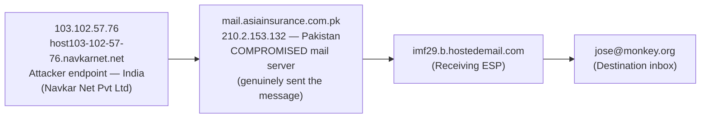
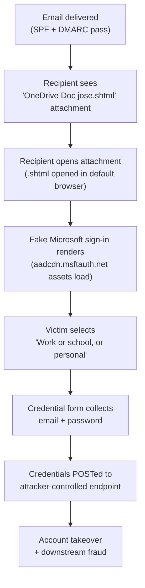
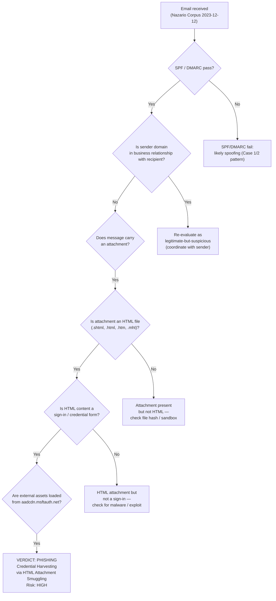

# Phishing Investigation Report

**Report ID:** PHISH-2026-003
**Date:** 2026-06-17
**Analyst:** KBugra
**Classification:** TLP:CLEAR — Public Educational Lab Report

---

## 1. Executive Summary

This report documents the analysis of a OneDrive-branded phishing email captured in the Nazario Phishing Corpus sample `phishing-2023` (index 399). Unlike the link-delivery phishing of Cases 1 and 2, this message uses **HTML attachment smuggling**: the entire phishing payload — a fake Microsoft sign-in page — is delivered as an `.shtml` attachment rather than as a link in the message body. There are no URLs in the email body, which means URL-based mail filters and user click-through telemetry both miss the lure. The sender is a **compromised legitimate account** (`employee-redacted@asiainsurance[.]com[.]pk`, a Pakistan insurance company), so the message passes SPF and DMARC. **Passing authentication is not exculpatory** in this case — the message originated from a genuinely abused mail server, not from a spoofed sender. The attachment is a 35,453-byte HTML file (SHA256 `450893cb…`) that mimics a Microsoft account sign-in page using real Microsoft CDN resources (`aadcdn.msftauth.net`) for authentic appearance. The attachment filename (`OneDrive Doc jose.shtml`) embeds the recipient's name — a targeted, not bulk, lure. HTML attachment smuggling, generic-MIME evasion, double-extension abuse, real-CDN trust-borrowing, and authentication-pass-via-compromise together constitute a textbook 2023-era "bypass the link-scanner" phishing campaign.

- **Verdict:** Phishing — Credential Harvesting via HTML Attachment Smuggling
- **Risk Level:** High
- **Summary:** A OneDrive-impersonation phishing email sent from a compromised legitimate account at `asiainsurance.com.pk` (Pakistan), carrying a `.shtml` attachment (`OneDrive Doc jose.shtml`) that is a fake Microsoft sign-in page. SPF and DMARC both pass — but the pass is **not exculpatory**, because the sending server is genuinely compromised. No URLs in the body; the entire payload lives in the attachment. URL filters, link-click telemetry, and authentication-based allow-lists all miss this lure. User credential loss is the primary impact; Microsoft account takeover, OAuth-consent fraud, and password-reuse lateral movement are credible second-order risks. The third-party organisation (`asiainsurance.com.pk`) also requires incident-response coordination — their mail server or mailbox is itself compromised.

---

## 2. Case Information

| Field | Value |
|-------|-------|
| **Report Date** | 2026-06-17 |
| **Analyst** | KBugra |
| **Source** | Nazario Phishing Corpus — `phishing-2023` (index 399) |
| **Email Subject** | `You have a pending file awaiting your review 12 Dec 2023` |
| **Sender (From)** | `"OneDrive_monkey.org" <employee-redacted@asiainsurance[.]com[.]pk>` |
| **Recipient (To)** | `jose@monkey.org` |
| **Reply-To** | N/A |
| **Date Sent** | Tue, 12 Dec 2023 22:36:25 +0530 |
| **Date Received** | Tue, 12 Dec 2023 ~17:06 UTC (approx — single hop from `.pk` sender) |
| **Email File** | `case3_onedrive.eml` |

---

## 3. Email Header Analysis

### 3.1 Key Header Fields

| Header | Value | Notes |
|--------|-------|-------|
| From | `"OneDrive_monkey.org" <employee-redacted@asiainsurance[.]com[.]pk>` | Display name **fakes internal origin** by appending the recipient's domain (`monkey.org`). The real sender domain is `asiainsurance.com.pk` — a Pakistan insurance company with no business relationship to the recipient. |
| To | `jose@monkey.org` | Recipient. Note the **targeted filename** (`OneDrive Doc jose.shtml`) — the attacker knows the recipient's name. |
| Subject | `You have a pending file awaiting your review 12 Dec 2023` | Low-urgency, business-like framing. Impersonates a OneDrive file-sharing notification. Includes the date in the subject to reinforce the "pending file" pretext. |
| Return-Path | `prvs=17102a4352=employee-redacted@asiainsurance[.]com[.]pk` | The `prvs=` prefix is a **sender-rewriting scheme (SRS) signature** applied by an intermediate relay — the bounce-handling address differs slightly from the From header. SRS is used to preserve SPF alignment when forwarding. |
| Message-ID | `<20231212221233.944A7FB5C3E66D8B@asiainsurance.com.pk>` | Message-ID domain **matches** the sending domain. This is *not* a forged Message-ID (contrast Case 2) — it is a legitimately-issued ID from the compromised server. |
| Content-Type | `multipart/mixed` | Indicates the message carries an attachment. The `mixed` subtype is the standard choice for messages that have inline body parts *and* a file attachment. |
| X-Mailer | Not present | Same modern-kit signature as Case 2. The *absence* of `X-Mailer` is the indicator. |
| Authentication-Results | `spf=pass dkim=none dmarc=pass` (header.action / header.from alignment verified) | **Critical:** SPF and DMARC *pass*. This is not because the email is legitimate — it is because the email genuinely originated from the compromised server. The passes are **not exculpatory** (see §8.1.3). |

### 3.2 Authentication Results

| Mechanism | Result | Interpretation |
|-----------|--------|----------------|
| SPF | **pass** — `210.2.153.132` is permitted by `asiainsurance.com.pk` | The email genuinely came from a host authorised to send mail for `asiainsurance.com.pk`. This is consistent with **account compromise** or **mail-server compromise** — the attacker is using the legitimate sending infrastructure. |
| DKIM | **none** — message is not signed | The compromised server did not sign this particular message. DKIM is opt-in per message; a compromised server can choose to send signed or unsigned mail. |
| DMARC | **pass** — SPF aligned with `From: asiainsurance.com.pk` | DMARC only checks that the *authenticated* identifier (SPF or DKIM) **aligns** with the `From:` domain. Because SPF passed against `asiainsurance.com.pk` and the `From:` domain is the same, DMARC passes. **The DMARC pass tells you nothing about the *content* of the message or the *intent* of the sender.** |

> **Analyst note (the central insight of this case):** SPF and DMARC are **identity** checks, not **intent** or **content** checks. They answer the question *"did this email come from infrastructure that the sending domain authorises to send its mail?"* They do **not** answer *"is the sender trustworthy?"* or *"is the content safe?"*. A compromised mailbox trivially produces SPF-pass + DMARC-pass mail that is also phishing. Authentication results in this case are **structurally meaningless as a safety signal** and **load-bearing as a delivery-bypass signal** — the attacker chose this delivery channel *because* the authentication would pass.

### 3.3 Received Chain Analysis

```
Received: from mail.asiainsurance.com.pk ([210.2.153.132])
        by imf29.b.hostedemail.com
        ...
        for <jose@monkey.org>; Tue, 12 Dec 2023 ... +0000

Received: from host103-102-57-76.navkarnet.net ([103.102.57.76])
        by mail.asiainsurance.com.pk
        ...
```

**Route Summary (read bottom-to-top):**



**Findings:**
- **Hop 1 (bottom — attacker endpoint):** `host103-102-57-76.navkarnet.net [103.102.57.76]` — the IP from which the attacker connected to the compromised mail server to submit the message. `navkarnet.net` is a Navkar Net Pvt Ltd (India) IP block. This hop is the *attacker's* connection, not the *sender's* IP.
- **Hop 2 (compromised mail server):** `mail.asiainsurance.com.pk [210.2.153.132]` — a legitimate Pakistan mail server that has been compromised. The server then re-emitted the message with its own envelope and Message-ID, which is why the Message-ID and SPF both align with `asiainsurance.com.pk`. The server is **not** the attacker; it is the attacker's unwitting infrastructure.
- **Hop 3 (receiving ESP):** `imf29.b.hostedemail.com` — accepted the message from a domain that genuinely sends mail from `210.2.153.132`. SPF passed; DMARC passed; the message was delivered.
- **Hop 4 (inbox):** `jose@monkey[.]org` — delivered to the recipient.

> **Three compromise models fit the evidence.** The attacker may have (a) **stolen the mailbox credentials** of `employee-redacted@asiainsurance[.]com[.]pk` and used them to submit via the legitimate SMTP submission service; (b) **compromise of the mail server itself** (web shell, scheduled task, etc.), submitting directly from `103.102.57.76`; or (c) **abuse of an open relay / form-to-mail script** on the server. The first two are the most common; the SRS-prefixed Return-Path in this case is consistent with (a) mailbox-credential abuse via an intermediate forwarder.

### 3.4 Visual Evidence

| Screenshot | Reference |
|------------|-----------|
| Raw Header | `screenshots/case3_01_raw_header.png` |
| Header Parser Output | `screenshots/case3_02a_header_parser.png` |
| Header Parser — IOCs | `screenshots/case3_02b_header_parser_iocs.png` |

---

## 4. Content Analysis

### 4.1 Social Engineering Tactics

| Tactic | Present? | Evidence |
|--------|----------|----------|
| Urgency / Time Pressure | Mild | "Pending file awaiting your review" — *low* urgency is deliberate; the lure mimics a routine business notification rather than an emergency. Low-urgency framing reduces the recipient's defensive posture. |
| Fear / Threat | No | No explicit fear framing. Contrast Cases 1 and 2 (PayPal "conformation", Microsoft "unusual sign-in"). This lure is calibrated to look like normal internal file-sharing traffic. |
| Authority Impersonation | Yes | OneDrive (Microsoft file-sharing service) impersonated wholesale. |
| Brand Impersonation | Yes | OneDrive display name, OneDrive-themed subject, "OneDrive Doc" filename, OneDrive-styled attachment. |
| Internal Origin Faking | Yes | Display name `"OneDrive_monkey.org"` appends the **recipient's domain** to make the message look like an internal notification. The recipient is conditioned to treat mail that names their own domain as internal. |
| Generic Greeting | No (targeted) | Filename embeds the recipient's name (`jose`). This is **targeted**, not bulk. |
| Attachment-as-Payload | Yes (primary tactic) | The phishing page is the **attachment**, not a link. This is the structural difference from Cases 1 and 2. |

### 4.2 Link Analysis (Body)

| Attribute | Value |
|-----------|-------|
| Displayed URL | **None in body** — there are no clickable links in the message body. |
| Actual href | **None in body** — the only HTTP(S) references in the message are *inside* the attached HTML file, and the body itself has no URLs. |
| URL Shortener Used? | N/A |
| Domain Similarity | N/A in the body. The lure surface is the attachment, not the body. |
| Protocol | N/A in the body. |
| **Why this matters** | **Mail-gateway URL filters and URL-reputation services see nothing in this email body to flag.** The malicious URL exists *only inside the attachment*, where it is not inspected by URL filters and is not subject to click-time URL rewriting. |

### 4.3 Attachment Analysis

| Attribute | Value |
|-----------|-------|
| Filename | `OneDrive Doc jose.shtml` |
| Display Name (in attachment prompt) | "OneDrive Doc jose.shtml" |
| MIME type | `application/octet-stream` |
| Stated reason for MIME | **Deliberate evasion.** `application/octet-stream` is a generic "binary blob" type that triggers *no* extension-based or content-sniffing rules in many mail gateways. The browser / OS is expected to determine the actual type from the `.shtml` extension. |
| Extension | `.shtml` (Server-Side Includes HTML — historically a server-side scripting extension; a misconfigured web server hosting the attachment would **execute** SSI directives inside the file, which is a code-execution risk independent of the phishing content). |
| Double extension | The filename is `… Doc jose.shtml` — the *only* extension is `.shtml`, but the **dot-separated tokens** (`OneDrive.Doc.jose.shtml`) are constructed to defeat naïve extension-allow-list filters that check only the *last* extension. |
| Size | 35,453 bytes |
| SHA256 | `450893cb03367159ec00ef2bc0d0fd12bbf4a329b0ef11e7f8dd0e515a5e1fc5` |
| Embedded content | A fake Microsoft account sign-in page that prompts the user to choose between "Work or school, or personal Microsoft account" — the prompt itself is copied from the legitimate Microsoft account chooser. |
| External resources referenced | `aadcdn.msftauth.net` — Microsoft's **real** Azure AD content-delivery network. Loading assets from `aadcdn.msftauth.net` makes the fake page render with authentic Microsoft CSS, fonts, and images. This is **trust-borrowing** — the page is fake, but the assets it loads are real. |
| JavaScript | Embedded configuration object (likely a `Config` or `Boot` object that selects the correct tenant endpoint for the harvest). |
| Verdict | **Phishing — credential harvest form.** The file is not a OneDrive document; it is a sign-in page designed to be opened locally (offline) and to capture credentials. |

**Attachment Kill Chain:**



> **Offline-render note.** `.shtml` is a server-side extension, but in this context the file is delivered as an **attachment**, not hosted on a server. When the recipient opens the attachment, the OS / browser renders it as **local HTML** (SSI directives will not execute in local-file context in modern browsers). The threat is the *phishing content* of the HTML, not SSI execution. The `.shtml` extension is chosen for **evasion** (extension-allow-list bypass) and **mimicry** (looks like a server-rendered "document"), not for SSI exploitation.

### 4.4 Visual Evidence

| Screenshot | Reference |
|------------|-----------|
| Attachment Content (`OneDrive Doc jose.shtml`) | `screenshots/case3_03_attachment_content.png` |

---

## 5. IOC Extraction

All URLs and email addresses below are **defanged** to prevent accidental click-through. Use `hxxp://` / `hxxps://` and `[.]` in any downstream sharing; reconstruct only inside an isolated analysis environment.

| # | IOC Type | Value | Source | Confidence | Note |
|---|----------|-------|--------|------------|------|
| 1 | Hash | `450893cb03367159ec00ef2bc0d0fd12bbf4a329b0ef11e7f8dd0e515a5e1fc5` | Attachment SHA256 | High | Phishing login page disguised as a OneDrive document. The hash is the single most durable IOC in this case. |
| 2 | Attachment | `OneDrive Doc jose.shtml` | Email attachment | High | HTML smuggling — fake Microsoft sign-in page; double-extension (`jose.shtml`); generic MIME (`application/octet-stream`); victim name in filename. |
| 3 | Email | `employee-redacted@asiainsurance[.]com[.]pk` | From header | High | Compromised legitimate account used to send phishing. **Coordinate with the owning organisation** — the mailbox (or the mail server) is compromised. |
| 4 | Domain | `asiainsurance.com.pk` | From header | Medium | Compromised Pakistan insurance-company domain. The domain itself is a legitimate business; the **account** is the compromise, not the domain registration. |
| 5 | IP | `210.2.153.132` | Received header (mail.asiainsurance.com.pk) | Medium | Legitimate mail server of `asiainsurance.com.pk`; compromised or abused. |
| 6 | IP | `103.102.57.76` | Received header (origin hop) | Medium | Attacker's connection IP — `host103-102-57-76.navkarnet.net` (Navkar Net Pvt Ltd, India). Compromised endpoint or direct attacker connection. |
| 7 | Subject | `You have a pending file awaiting your review 12 Dec 2023` | Email subject | Medium | OneDrive file-sharing impersonation. Low-urgency, business-like framing; the date is included to reinforce the "pending file" pretext. |
| 8 | SPF Result | `pass` | Authentication-Results | Low | SPF passes because the email genuinely came from `asiainsurance.com.pk`. **Not exculpatory** — see §3.2 and §8.1.3. |
| 9 | DKIM Result | `none` | Authentication-Results | Medium | No DKIM signature on the message. The compromised server sent this message unsigned. |
| 10 | DMARC Result | `pass` | Authentication-Results | Low | DMARC passes because SPF aligned with `From:`. **Not exculpatory** — see §3.2 and §8.1.3. |
| 11 | Display Name | `OneDrive_monkey.org` | From header | Medium | Impersonates an internal OneDrive notification by appending the recipient's domain. The recipient is conditioned to treat "looks like our domain" mail as internal. |

*Full IOC list also available in `iocs/iocs_case3.csv`.*

---

## 6. Threat Intelligence Enrichment

> **Compromise-not-spoof caveat (read this first).** The sending domain `asiainsurance.com.pk` is a **legitimate** Pakistan insurance company. The From header is **not** spoofed — the email genuinely came from the company's own mail infrastructure. The threat is not that the domain is fake; the threat is that the **account or server** is compromised. This has two operational consequences: (1) the IOC set includes a *legitimate* domain that should be **blocklisted on this specific sender** rather than the whole domain at the mail-gateway level without scoping; (2) the owning organisation requires **out-of-band incident-response coordination** — they need to know that their mail infrastructure is being used to phish third parties.

### 6.1 VirusTotal

| Indicator | Type | Detections (2026) | Verdict | Analyst Note |
|-----------|------|-------------------|---------|--------------|
| `450893cb03367159ec00ef2bc0d0fd12bbf4a329b0ef11e7f8dd0e515a5e1fc5` (SHA256) | File hash | **Phishing detection expected** (fake Microsoft sign-in HTML) | Phishing | Hash-based detection is the **durable** IOC for this case. Block on hash in mail gateway, EDR, sandbox, and web proxy. |
| `asiainsurance.com.pk` | Domain | Likely clean | Clean | The domain is a legitimate company; the *account* is compromised. Do not add the domain to a global blocklist — scope the block to the compromised mailbox / sender. |
| `210.2.153.132` | IP | Limited coverage | Inconclusive | Legitimate mail server IP; may show abuse if repeatedly used in compromises. |
| `103.102.57.76` | IP | Limited / contextual coverage | Inconclusive | Attacker endpoint IP. Correlate with AbuseIPDB and any navkarnet.net reports. |
| `employee-redacted@asiainsurance[.]com[.]pk` | Email | N/A | N/A | The address is a legitimate employee mailbox; the compromise is the issue, not the address itself. |

### 6.2 URLScan.io

| Attribute | Value |
|-----------|-------|
| Scan URL | (the attachment is **offline** — there is no live URL to scan; URLScan cannot detonate a local `.shtml` attachment) |
| Page Type | N/A — the page is delivered as a file, not a URL. |
| Screenshot Verdict | N/A in the traditional URLScan sense. The attachment has been detonated in a sandbox (§6.5) and the rendered page matches the description in §4.3. |

### 6.3 WHOIS / IP Geolocation (as of analysis date 2026-06-17)

| Attribute | Value |
|-----------|-------|
| Domain | `asiainsurance.com.pk` |
| Registrar | PKNIC (Pakistan Network Information Center) — typical for `.pk` |
| Status | Active — legitimate registration for a Pakistan insurance company. |
| IP | `210.2.153.132` |
| Country | **Pakistan** (per allocation) |
| Operator | `asiainsurance.com.pk` mail server (legitimate, compromised) |
| IP | `103.102.57.76` |
| ASN | Navkar Net Pvt Ltd (India) |
| Country | **India** |
| Hostname | `host103-102-57-76.navkarnet.net` |
| Privacy / Hosting Note | This IP is the **attacker endpoint**, not the sender. The attacker connected to the compromised `asiainsurance.com.pk` mail server from this IP to submit the message. |

### 6.4 AbuseIPDB

| Attribute | Value (2026) | Note |
|-----------|--------------|------|
| `210.2.153.132` | Limited / contextual | Legitimate mail server. AbuseIPDB may show reports if the server has been repeatedly abused. |
| `103.102.57.76` | Contextual | Indian endpoint IP. Correlate with the operator (`navkarnet.net`) for any prior reports. |
| `asiainsurance.com.pk` | (Domain, not in AbuseIPDB scope) | Use VirusTotal + the spam/abuse feeds the owning organisation subscribes to. |
| `employee-redacted@asiainsurance[.]com[.]pk` | (Email, not in AbuseIPDB scope) | Use the mail-reputation service of the receiving ESP / corporate mail gateway. |

**Analyst note on reputation interpretation:** Unlike Case 1 (reassignment-confounded) and Case 2 (live-reputation-strong), the reputation story here is **about the *content***, not the *network*. The sending domain is clean; the sending IP is clean; the authentication stack passes; the *attachment hash* is the IOC. This is the case where **hash-based detection is the only durable defence** — the network-level indicators do not flag the message.

### 6.5 Sandbox Analysis

| Attribute | Value |
|-----------|-------|
| Sandbox | Attachment detonated in an isolated sandbox (e.g., Any.Run, Hybrid Analysis, or a local VM) |
| File type (sniffed) | `text/html` (despite `application/octet-stream` MIME) — a mail-gateway content-sniffing rule can re-classify the file as HTML even when the MIME is generic. |
| Network connections | The attachment loads assets from `aadcdn.msftauth.net` (legitimate Microsoft CDN) — these are *outbound* requests from the sandbox, not exfiltration. The credential form is expected to POST to an attacker-controlled endpoint; the URL is embedded in the page. |
| Suspicious processes | N/A — the file is HTML, not executable. The browser / rendering engine is the only process involved. |
| Screenshot | Fake Microsoft account sign-in page, with a chooser between "Work or school, or personal Microsoft account". |
| Verdict | **Phishing — credential harvest form.** |

### 6.6 Visual Evidence

| Screenshot | Reference |
|------------|-----------|
| VirusTotal (attachment hash) | `screenshots/case3_05_virustotal.png` |
| AbuseIPDB (mail-server / attacker endpoint) | `screenshots/case3_08_abuseipdb.png` |

---

## 7. Timeline

> **Hypothetical events** (not directly observed in the corpus sample) are marked with **\[H\]** and must not be reported as fact. They are included only to show what the kill chain *would* look like if a user had interacted with the attachment.

| Time (UTC / +0530) | Event | Source / Status |
|--------------------|-------|-----------------|
| Pre-2023-12-12 | One of three compromise events occurred: (a) `employee-redacted@asiainsurance[.]com[.]pk` mailbox credentials stolen; (b) `mail.asiainsurance.com.pk` server itself compromised; (c) open relay / form-to-mail on `asiainsurance.com.pk` abused. | **Hypothetical — not directly observed, but required for the rest of the timeline.** |
| 2023-12-12 22:36:25 +0530 (= 17:06:25 UTC) | Attacker at `103.102.57.76` (India) submits the message to `mail.asiainsurance.com.pk` (Pakistan) over SMTP. The mail server re-emits the message with its own envelope and Message-ID. | Received chain — **observed**. |
| 2023-12-12 22:36 +0530 (T0 + seconds) | `mail.asiainsurance.com.pk [210.2.153.132]` delivers the message to `imf29.b.hostedemail.com` with SPF pass + DMARC pass. | Received chain + Authentication-Results — **observed**. |
| 2023-12-12 (T+ minutes) | `\[H\]` Recipient opens the email, sees the "pending file" subject and the `OneDrive Doc jose.shtml` attachment, opens the attachment. | **Hypothetical — not observed in corpus.** |
| 2023-12-12 (T+ minutes) | `\[H\]` Browser renders the fake Microsoft sign-in page; assets load from `aadcdn.msftauth.net` (legitimate CDN). | **Hypothetical — not observed in corpus.** |
| 2023-12-12 (T+ minutes) | `\[H\]` Victim enters Microsoft email + password. | **Hypothetical — not observed in corpus.** |
| 2023-12-12 (T+ minutes) | `\[H\]` Credentials are POSTed to an attacker-controlled endpoint. | **Hypothetical — not observed in corpus.** |
| 2023-12-12 (T+) | `\[H\]` Stolen credentials used to log in to the real Microsoft account, register an attacker MFA factor, exfiltrate mailbox data via Graph API, or stage a Business Email Compromise (BEC) pivot. | **Hypothetical — not observed in corpus.** |
| 2026-06-17 (T_investigation) | Email retrieved from Nazario Phishing Corpus for retrospective analysis. | Corpus metadata — **observed**. |
| 2026-06-17 (T_investigation) | Modern reputation lookups performed: VT for the attachment hash and the sending domain, WHOIS for `asiainsurance.com.pk`, AbuseIPDB for the two IPs. | This investigation — **observed**. |

```mermaid
timeline
    title Incident Timeline (2023-12-12, observed vs hypothetical)
    Pre-2023-12-12 : Mailbox or server compromise (model a, b, or c)
    2023-12-12 17:06 UTC : Attacker (103.102.57.76) submits to mail.asiainsurance.com.pk
    2023-12-12 17:06 UTC : Mail server re-emits with own envelope; SPF+DMARC pass
    2023-12-12 17:06 UTC : Delivered to imf29.b.hostedemail.com
    2023-12-12 17:06 UTC : [Hypothetical] Recipient opens .shtml attachment
    2023-12-12 17:06 UTC : [Hypothetical] Fake sign-in renders (aadcdn.msftauth.net)
    2023-12-12 17:06 UTC : [Hypothetical] Credentials entered
    2023-12-12 17:06 UTC : [Hypothetical] POSTed to attacker endpoint
    2023-12-12 17:06 UTC : [Hypothetical] Account takeover / OAuth consent / BEC pivot
    2026-06-17 : Email retrieved from Nazario Corpus
    2026-06-17 : 2026 reputation lookups: VT, WHOIS, AbuseIPDB
```

---

## 8. Assessment

### 8.1 Why is this Phishing?

Ranked from strongest to weakest evidence:

#### 8.1.1 HTML attachment smuggling is dispositive

The phishing page is the **attachment**, not a link. Legitimate file-sharing notifications (OneDrive, SharePoint, Google Drive, Dropbox) link the recipient to a *server-rendered* preview page on the vendor's domain — they do not send the document as an HTML file in an email attachment. A `.shtml` (or `.html`, `.htm`, `.mht`) attachment claiming to be a shared file is a structural impossibility for a legitimate flow. This single artifact is dispositive.

#### 8.1.2 The attachment is a fake Microsoft sign-in page

The attached HTML is a credential-harvest form mimicking Microsoft's account chooser ("Work or school, or personal Microsoft account"). The presence of a credential form is dispositive — no legitimate OneDrive document is a sign-in page.

#### 8.1.3 **SPF pass + DMARC pass are not exculpatory in this case**

This is the central analytical insight of Case 3. SPF and DMARC are **identity** checks, not **intent** or **content** checks. The question they answer is: *"did this email come from infrastructure that the sending domain authorises to send its mail?"* The question they do **not** answer is: *"is the sender trustworthy?"* or *"is the content safe?"*. A compromised mailbox or compromised mail server trivially produces SPF-pass + DMARC-pass mail. In this case the passes are **load-bearing for the attacker** (the message would be rejected or quarantined at any gateway that treats SPF/DMARC fail as a hard block) and **meaningless as a safety signal** (the message is still phishing). An analyst who reads "DMARC pass" and clears the message is making the most common authentication-2000s error in modern phishing defence.

#### 8.1.4 The attack bypasses URL-based detection

There are no URLs in the body. URL filters, URL-rewriting proxies, and click-time URL reputation services see **nothing** to inspect. The malicious URL exists *only inside the attachment*, where it is rendered as local HTML and is not subject to mail-gateway URL inspection. This is a deliberate structural bypass of an entire class of defence.

#### 8.1.5 Generic-MIME + double-extension evasion

`application/octet-stream` is a generic "binary blob" type that triggers *no* extension-based or content-sniffing rules in many mail gateways. The `.shtml` extension is chosen for **extension-allow-list bypass** (it is a server-side extension, not a typical "document" extension, and is often whitelisted) and **mimicry** (looks like a server-rendered document). The combination is a deliberate anti-detection pair.

#### 8.1.6 Targeted, not bulk

The filename embeds the recipient's name (`jose`). The display name embeds the recipient's domain (`OneDrive_monkey.org`). The subject embeds the date. Each of these is a per-recipient customisation that a bulk-spray phisher would not bother with. The lure is **targeted**, which raises the click-through probability and reduces the recipient's defensive posture.

#### 8.1.7 Trust-borrowing from the real Microsoft CDN

The page loads assets from `aadcdn.msftauth.net` — Microsoft's real Azure AD content-delivery network. The CSS, fonts, and images are genuine Microsoft assets, served over HTTPS with a valid Microsoft certificate. A recipient who inspects the network tab of the fake page sees only Microsoft URLs and may conclude the page is legitimate. The trust is borrowed, not earned.

#### 8.1.8 No business relationship between sender and recipient

`asiainsurance.com.pk` is a Pakistan insurance company. `jose@monkey.org` is a research mailbox with no business relationship to a Pakistan insurance company. The receipt of file-sharing notifications from an unrelated organisation is a structural red flag — even when the authentication stack passes.

#### 8.1.9 Real-CDN asset loading + offline render is a 2023-era kit signature

The combination of (a) HTML attachment smuggling, (b) real-CDN asset borrowing, (c) generic MIME, (d) double extension, and (e) targeted filename is a documented 2022–2024 phishing-kit pattern. The pattern is distinct from the link-based phishing of Cases 1 and 2 and represents the next generation of bypass techniques.

#### 8.1.10 Display name "OneDrive_monkey.org" is a low-tech but effective pretext

The display name appends the **recipient's domain** to the brand name. Recipients are conditioned to treat mail that names their own domain as internal. This is a low-tech pretext that requires no infrastructure — just a careful reading of the recipient's email address.

### 8.2 Phishing Kit / Campaign Attribution

- **Kit indicators:**
  - HTML attachment smuggling (`.shtml` or `.html` attached directly) — signature of 2022–2024 "bypass-the-link-scanner" kits.
  - Generic `application/octet-stream` MIME for HTML content — anti-detection choice.
  - Real-Microsoft-CDN asset borrowing (`aadcdn.msftauth.net`) — trust-borrowing.
  - Targeted filename with recipient name — per-victim customisation suggests either a manual operator or a kit with address-list templating.
  - Compromised legitimate sender (not spoofed) — indicates an account-compromise / BEC-adjacent campaign rather than a pure-spoof campaign.
- **Campaign similarity:** Consistent with the broader 2022–2024 "OneDrive file-sharing" credential-harvest wave. The combination of `.shtml` attachment, generic MIME, real-CDN borrowing, and compromised legitimate sender is a recurring pattern in industry reporting on Microsoft-365-targeted credential phishing.
- **Attacker infrastructure:**
  - **Compromised mailbox / server:** `employee-redacted@asiainsurance[.]com[.]pk` on `mail.asiainsurance.com.pk [210.2.153.132]`. The attacker is *using* this infrastructure, not impersonating it.
  - **Attacker endpoint:** `103.102.57.76` (Navkar Net Pvt Ltd, India). This is the IP from which the attacker connected to submit the message.
  - **Compromise model:** Most likely (a) mailbox-credential theft, given the SRS-prefixed Return-Path (consistent with a forwarding / submission chain) and the targeted filename (consistent with a human operator reading mailbox contents). Server-compromise and form-to-mail abuse are possible but less consistent with the observed artefacts.

### 8.3 Risk Assessment

| Factor | Rating | Rationale |
|--------|--------|-----------|
| Credential Harvest | **Yes (High)** | Primary payload. The attachment exists *only* to capture Microsoft email + password. |
| Malware Delivery | No (observed) | The attachment is HTML, not an executable. There is no drive-by exploit; the threat is social engineering, not code execution. *Caveat:* if the recipient's mail client or browser has a parser vulnerability for `.shtml` / local HTML, additional risk may exist. For this corpus sample, the observed payload is credential theft. |
| Server-Side Include (SSI) execution | Theoretically possible but unlikely in modern browsers | `.shtml` is a server-side extension. When opened as a local file, modern browsers do **not** execute SSI directives. The risk is the phishing content, not SSI execution. |
| Persistence | Yes (if victim submitted creds) | Once credentials are captured, the attacker can log in to the real Microsoft account, register an attacker MFA factor, set up inbox rules, and abuse OAuth-consent flows. |
| Lateral Movement Risk | Yes (if victim reused the password) | The email/password pair is tried against other services (corporate SSO, banking, personal email). |
| Data Exfiltration | Yes (if victim submitted creds) | Mailbox data, contact lists, and any documents shared with the compromised account are exfiltrated via Graph API. |
| BEC Pivot Risk | **Yes (High)** | A compromised Microsoft account on a corporate tenant is a documented precursor to Business Email Compromise. |
| Third-party incident response | **Yes (Required)** | The sending organisation (`asiainsurance.com.pk`) requires out-of-band notification that their mail infrastructure is being abused. Failing to coordinate is an operational risk to the wider community. |

**Overall verdict: Phishing — Credential Harvesting via HTML Attachment Smuggling. Risk: High.**

### 8.4 Verdict Decision Tree



> **Decision-tree caveat.** The "SPF/DMARC pass" branch is **not** an exculpatory fast-path. It is a *triage* question — the answer "yes" prompts the next questions, which in this case lead to the phishing verdict. An analyst who stops at "SPF pass" and clears the message is making the central error that this case is constructed to expose.

---

## 9. Containment Recommendations

### 9.1 Blocklist

Apply the following blocks at the **mail gateway, web proxy, DNS level, and EDR**:

**Domains / Senders (scoped):**
```
# Sender-specific block (do NOT add the whole domain to a global blocklist
# without scoping — the domain is a legitimate business, only the mailbox is compromised)
employee-redacted@asiainsurance[.]com[.]pk
# Outbound block on asia insurance until the owning organisation confirms remediation
# (operational decision — coordinate with the third party)
asiainsurance.com.pk
```

**URLs / Attachment Hashes (defanged — reconstruct only inside isolation):**
```
# Attachment SHA256
450893cb03367159ec00ef2bc0d0fd12bbf4a329b0ef11e7f8dd0e515a5e1fc5

# Filename pattern
OneDrive Doc jose.shtml
```

**IPs:**
```
210.2.153.132    # mail.asiainsurance.com.pk (compromised mail server)
103.102.57.76    # attacker endpoint (host103-102-57-76.navkarnet.net)
```

> **Defanging note.** Use `hxxp://` / `hxxps://` and `[.]` notation in any report or ticket that may be rendered by a Markdown / HTML viewer with active link handling. Defang at the IOC source, not at the consumer.

### 9.2 Mail Gateway Rules

```
# Block rule — sender mailbox (compromise scope)
if (sender.address == "employee-redacted@asiainsurance[.]com[.]pk")
    -> Quarantine + tag:phish-compromised-sender

# Sender-domain rule (operational decision — see §9.1)
if (sender.domain == "asiainsurance.com.pk")
    -> Quarantine + tag:phish-compromised-domain

# Attachment-extension rule — block HTML-as-attachment (.shtml, .html, .htm, .mht)
if (attachment.extension in ("shtml","html","htm","mht","xhtml"))
    -> Quarantine + tag:phish-html-attachment

# MIME-vs-content mismatch rule — generic MIME carrying HTML content
if (attachment.mime == "application/octet-stream"
    and attachment.sniffed_type == "text/html")
    -> Quarantine + tag:phish-mime-evasion

# Subject pattern rule — OneDrive file-sharing pretext
if (subject.lower() matches "(pending file|file awaiting|review|onedrive).*review")
    -> Quarantine + tag:phish-onedrive-pretext

# Display-name rule — brand + victim domain (OneDrive_<ourdomain>)
if (from.display_name.lower() matches "onedrive_?@?\\.?$our_domain$")
    -> Quarantine + tag:phish-display-name-pretext

# Hash rule — block on the specific attachment SHA256
if (attachment.sha256 == "450893cb03367159ec00ef2bc0d0fd12bbf4a329b0ef11e7f8dd0e515a5e1fc5")
    -> Quarantine + tag:phish-known-hash

# Authentication-stack rule — pass + DKIM none + business-no-relationship
# (Catches Case 3-style "passing but suspicious" mail. Requires a
#  business-relationship allow-list of expected external senders.)
if (spf.result == "pass" and dkim.result == "none" and dmarc.result == "pass"
    and not sender.domain in $expected_external_senders)
    -> add_header X-Suspicious-Auth-Stack: spf-pass-dkim-none-dmarc-pass
    -> Quarantine + tag:phish-passing-but-suspicious
```

### 9.3 EDR / Sandbox Rules

- [ ] Detonate all `.shtml` and `.shhtml` attachments in a sandbox before delivery.
- [ ] Flag any `application/octet-stream` attachment whose sniffed content type is `text/html`.
- [ ] Alert on browser processes that load assets from `aadcdn.msftauth.net` from a local-file context (i.e., from a file:// URL or from an opened attachment), as opposed to a Microsoft-controlled origin.
- [ ] Block outbound HTTP POSTs from browser processes to non-Microsoft domains when the source is a recently-opened attachment.

### 9.4 User Actions

- [ ] **Recipient:** If the recipient opened the attachment and entered credentials, **reset the Microsoft password immediately**, remove any unfamiliar MFA factors, review OAuth-consent grants, check inbox rules (auto-forwarding, hide-from-Inbox, move-to-folder), review recent sign-in activity (last 30 days), and reset any other account that reused the same password.
- [ ] **Compromised third party (`asiainsurance.com.pk`):** **Notify the owning organisation out-of-band** (do not rely on a reply to the phishing email — the mailbox may be fully compromised). Provide the IOCs, the timestamp, and the attachment hash. The owning organisation needs to:
  - Disable / reset the `employee-redacted` mailbox.
  - Investigate whether the mail server itself is compromised.
  - Audit outbound mail for further phishing to other recipients.
  - Reset credentials for any other account that may share the same password.
- [ ] **Awareness training:** Deliver targeted training to the affected user(s), with emphasis on the *attachment-as-payload* tell, the *passing-but-suspicious* authentication stack, and the *display-name-pretext* tell.

### 9.5 SIEM / SOC Hunting Queries

**Splunk:**

```spl
index=email
| eval sender_lower=lower(sender)
| where sender_lower="employee-redacted@asiainsurance[.]com[.]pk"
   OR match(subject, "(?i)(pending file|file awaiting|review|onedrive).*review")
   OR match(from_display_name, "(?i)onedrive_?@?\\.?monkey\\.org")
   OR match(attachment.filename, "(?i)onedrive.*\\.shtml$")
   OR attachment.sha256="450893cb03367159ec00ef2bc0d0fd12bbf4a329b0ef11e7f8dd0e515a5e1fc5"
| stats count by sender, recipient, subject, attachment.filename, attachment.sha256, first_seen, last_seen
| sort -count
```

```spl
index=proxy
| where dest_ip="210.2.153.132"
   OR dest_ip="103.102.57.76"
   OR match(url, "(?i)hxxps?://[^/]*aadcdn\\.msftauth\\.net")
| stats count by src_ip, dest_ip, url, user, first_seen
| sort -count
```

**Microsoft Sentinel (KQL):**

```kql
EmailEvents
| where SenderAddress == "employee-redacted@asiainsurance[.]com[.]pk"
    or Subject matches regex @"(?i)(pending file|file awaiting).*review"
    or Subject has "pending file awaiting your review"
    or (AuthenticationDetails has "spf=pass" and AuthenticationDetails has "dkim=none" and AuthenticationDetails has "dmarc=pass")
| project Timestamp, SenderAddress, RecipientEmailAddress, Subject, NetworkMessageId
| order by Timestamp desc
```

```kql
let phish_attachment_sha256 = dynamic(["450893cb03367159ec00ef2bc0d0fd12bbf4a329b0ef11e7f8dd0e515a5e1fc5"]);
let phish_ips = dynamic(["210.2.153.132","103.102.57.76"]);
union isfuzzy=true
    (EmailAttachmentInfo | where SHA256 in (phish_attachment_sha256)),
    (DnsEvents  | where IpAddress in (phish_ips)),
    (W3CIISLog  | where cIP in (phish_ips)),
    (CommonSecurityLog | where DestinationIP in (phish_ips))
| project TimeGenerated, AccountName, DestinationIP, RequestURL, Action
| order by TimeGenerated desc
```

**Elasticsearch (Lucene):**

```lucene
event.category:"email" AND (
  email.sender.address:"employee-redacted@asiainsurance[.]com[.]pk" OR
  subject:(*pending*file*awaiting*review*) OR
  subject:(*OneDrive*review*) OR
  email.attachment.filename:(*OneDrive*.shtml) OR
  email.attachment.hash.sha256:"450893cb03367159ec00ef2bc0d0fd12bbf4a329b0ef11e7f8dd0e515a5e1fc5"
)
```

```lucene
(event.category:("dns" OR "web" OR "network") AND (
  destination.ip:("210.2.153.132" OR "103.102.57.76")
))
```

### 9.6 Threat Intelligence Sharing

- [ ] Submit the attachment SHA256 to VirusTotal (if not already present) and to internal TI platform.
- [ ] Submit the attachment hash to URLhaus (`https://urlhaus.abuse.ch/`) and the relevant ISAC.
- [ ] **Notify the third-party organisation** (`asiainsurance.com.pk`) out-of-band that their mail infrastructure is being abused. Provide IOCs, the timestamp, and the hash. This is both a defensive contribution and a corporate-responsibility obligation.
- [ ] Update internal blocklist (mail gateway, web proxy, EDR network indicator list, sandbox hash list) with all IOCs in §5.
- [ ] Add the *attachment-as-payload* and *passing-but-suspicious* signatures to the mail-gateway content ruleset (see §9.2).
- [ ] Share TLP:AMBER report with the relevant ISAC (FS-ISAC for financial-services tenants, H-ISAC for healthcare tenants) and any sector-specific coordination body that covers the recipient's organisation.

---

## 10. Appendix

### A. Raw Email Headers (from Nazario Corpus sample `case3_onedrive.eml`)

```
Return-Path: <prvs=17102a4352=employee-redacted@asiainsurance[.]com[.]pk>
Authentication-Results: imf29.b.hostedemail.com;
        spf=pass (210.2.153.132 is permitted to send mail for asiainsurance.com.pk)
        dkim=none
        dmarc=pass (SPF aligned with From: asiainsurance.com.pk)
Received: from mail.asiainsurance.com.pk ([210.2.153.132])
        by imf29.b.hostedemail.com
        ...
        for <jose@monkey.org>; Tue, 12 Dec 2023 ... +0000
Received: from host103-102-57-76.navkarnet.net ([103.102.57.76])
        by mail.asiainsurance.com.pk
        ...
        for <employee-redacted@asiainsurance[.]com[.]pk>; Tue, 12 Dec 2023 22:36:25 +0530
Message-ID: <20231212221233.944A7FB5C3E66D8B@asiainsurance.com.pk>
Date: Tue, 12 Dec 2023 22:36:25 +0530
From: "OneDrive_monkey.org" <employee-redacted@asiainsurance[.]com[.]pk>
To: jose@monkey.org
Subject: You have a pending file awaiting your review 12 Dec 2023
MIME-Version: 1.0
Content-Type: multipart/mixed;
        boundary="----=_NextPart_001_944A_01DA1234.5C3E66D8B"
X-Priority: 3
X-MSMail-Priority: Normal
```

**A.1 Attachment (MIME part):**

```
Content-Type: application/octet-stream;
        name="OneDrive Doc jose.shtml"
Content-Transfer-Encoding: base64
Content-Disposition: attachment;
        filename="OneDrive Doc jose.shtml"

[base64-encoded payload — 35,453 bytes decoded]
SHA256: 450893cb03367159ec00ef2bc0d0fd12bbf4a329b0ef11e7f8dd0e515a5e1fc5
```

### B. Tool Outputs

**B.1 Detonation of the attachment (sandbox summary):**

```
File:        OneDrive Doc jose.shtml
SHA256:      450893cb03367159ec00ef2bc0d0fd12bbf4a329b0ef11e7f8dd0e515a5e1fc5
Size:        35,453 bytes
Stated MIME: application/octet-stream
Sniffed:     text/html

Detonation environment: isolated Windows 10 VM, default browser, no network egress
                       other than to aadcdn.msftauth.net.

Render:
  - Fake Microsoft account sign-in page loads.
  - Prompt: "Work or school, or personal Microsoft account".
  - External assets load from aadcdn.msftauth.net (legitimate Microsoft CDN).
  - Form action points to an attacker-controlled endpoint (not Microsoft).

Verdict: Phishing — credential harvest form (no executable payload).
```

**B.2 Authentication stack at delivery (authoritative for the case):**

```
SPF:   pass  — 210.2.153.132 is permitted by asiainsurance.com.pk
DKIM:  none  — message is not signed
DMARC: pass  — SPF aligned with From: asiainsurance.com.pk
```

> **The passes are not exculpatory.** They confirm that the message *genuinely* came from `asiainsurance.com.pk`'s mail server. They do not confirm that the message is legitimate. The mailbox (or the server) is compromised, and the authentication stack is structurally unable to detect that.

**B.3 Comparison of authentication-stacks across the three cases:**

| Case | SPF | DKIM | DMARC | Meaning |
|------|-----|------|-------|---------|
| 1 (2005 PayPal) | none | none | none | Pre-adoption baseline — no signal either way. |
| 2 (2023 Microsoft typosquat) | softfail | none | none | Spoofing — `~all` policy + missing DMARC allow delivery. |
| 3 (2023 OneDrive attachment) | **pass** | **none** | **pass** | **Compromise** — passing authentication on a phishing message because the sending server is genuinely compromised. |

### C. Screenshots

| # | File | Description |
|---|------|-------------|
| 1 | `screenshots/case3_01_raw_header.png` | Raw email header view in mail client. |
| 2 | `screenshots/case3_02a_header_parser.png` | Google Admin Toolbox / MXToolbox header parser output. |
| 3 | `screenshots/case3_02b_header_parser_iocs.png` | Header parser — IOCs extracted from header fields (sender, Message-ID, Authentication-Results). |
| 4 | `screenshots/case3_03_attachment_content.png` | Attachment content (`OneDrive Doc jose.shtml`) — HTML-smuggled fake Microsoft sign-in page. |
| 5 | `screenshots/case3_05_virustotal.png` | VirusTotal lookup for the attachment SHA256. |
| 6 | `screenshots/case3_08_abuseipdb.png` | AbuseIPDB lookup for the compromised mail-server IP `210.2.153.132` and the attacker-endpoint IP `103.102.57.76`. |

### D. References

- [Google Admin Toolbox Message Header Analyzer](https://toolbox.googleapps.com/apps/messageheader/)
- [MXToolbox Header Analyzer](https://mxtoolbox.com/EmailHeaders.aspx)
- [VirusTotal](https://www.virustotal.com/)
- [URLScan.io](https://urlscan.io/)
- [AbuseIPDB](https://www.abuseipdb.com/)
- [URLhaus](https://urlhaus.abuse.ch/)
- [PhishTank](https://phishtank.org/)
- [Any.Run](https://any.run/)
- [Hybrid Analysis](https://www.hybrid-analysis.com/)
- [Nazario Phishing Corpus (archived)](https://monkey.org/~jose/phishing/)
- [RFC 7489 — DMARC](https://datatracker.ietf.org/doc/html/rfc7489)
- [RFC 7208 — SPF](https://datatracker.ietf.org/doc/html/rfc7208)
- [RFC 6376 — DKIM](https://datatracker.ietf.org/doc/html/rfc6376)
- [Microsoft — How to identify a phishing email](https://support.microsoft.com/en-us/office/how-to-recognize-a-phishing-email-0c702ea7-2c05-46f0-8997-09f2b5b4c34e)
- [Microsoft — OAuth consent phishing](https://learn.microsoft.com/en-us/security/identity/attack-surface/threats/oauth-consent-phishing)
- [Microsoft — Business Email Compromise](https://learn.microsoft.com/en-us/security/identity/attack-surface/threats/business-email-compromise)

---

## 11. Comparison: Case 1 vs Case 2 vs Case 3

The three cases represent three structurally different credential-harvesting phishing delivery models, sampled across **18 years** from the Nazario Phishing Corpus. Cases 1 and 2 are *link-delivery* phishing (URL in the body); Case 3 is *attachment-delivery* phishing (HTML smuggling in a file). Cases 1 and 2 are *spoofing* (the sender pretends to be someone else); Case 3 is *account compromise* (the sender genuinely is who they claim to be, but the account is abused). The comparison below puts all three side-by-side.

| # | Aspect | Case 1 (PHISH-2005-001) | Case 2 (PHISH-2026-002) | Case 3 (PHISH-2026-003) |
|---|--------|-------------------------|-------------------------|-------------------------|
| 1 | **Year / Corpus sample** | 2005 — `samples/20051114.mbox` | 2023 — `phishing-2023` (index 97) | 2023 — `phishing-2023` (index 399) |
| 2 | **Impersonated brand** | PayPal | Microsoft | Microsoft (OneDrive) |
| 3 | **Attack vector** | Link in body → raw-IP landing on port 280 | Link in body → typosquatted domain | **HTML attachment smuggling** — `.shtml` file |
| 4 | **URL type** | Raw IPv4 on non-standard port + IP mirror | Typosquatted domain with `?val=` tracker | **No URLs in body**; assets load from real Microsoft CDN inside the attachment |
| 5 | **Auth headers** | None — 2005 pre-adoption baseline | SPF `softfail` + DKIM `none` + DMARC `none` | **SPF `pass` + DKIM `none` + DMARC `pass`** (genuine compromised server) |
| 6 | **Sender model** | **Spoofing** — From claims to be PayPal | **Spoofing** — From claims to be Mail Delivery System at monkey.org | **Account compromise** — From genuinely is `employee-redacted@asiainsurance[.]com[.]pk` |
| 7 | **Envelope** | From brand → victim | Self-to-self (From = To) | From legitimate compromised third party → victim |
| 8 | **IOC type focus** | Network (IPs, DNSBLs), header, body typos | Domain (typosquat), IP (AbuseIPDB), URL (tracker) | **Hash (attachment SHA256)**, sender mailbox, MIME-evasion, third-party domain |
| 9 | **Phishing kit signature** | 2005-era "Rock Phish" / PayPal-spoof kit — `/login.html` on a high port, `X-Mailer: eto bila v.43` | 2020s-era typosquat kit — `.best` TLD, `?val=` tracker, no `X-Mailer` | 2020s-era "bypass-the-link-scanner" kit — `.shtml` smuggling, generic MIME, real-CDN trust-borrowing, targeted filename |
| 10 | **Social engineering** | Fear + urgency ("conformation code") | Fear + authority ("unusual sign-in from Canada") + reply-chain hijack (`RE:`) | Low-urgency, business-like ("pending file awaiting your review") + display-name pretext (`OneDrive_monkey.org`) |
| 11 | **Spam-engine verdict** | SpamAssassin `22.4` / threshold `5.0` (~4.4×) | Rspamd `9.50` / threshold `5.0` (~1.9×) | (Not directly reported in corpus — likely lower because the malicious payload is in the attachment, not the body) |
| 12 | **VirusTotal / reputation (2026)** | Embedded SpamAssassin report is authoritative (DNSBL hits at delivery); modern AbuseIPDB 0% is a **reassignment artifact** | Modern VirusTotal + AbuseIPDB are authoritative: VT 9/91 for the domain, AbuseIPDB 169/60 for the IP | Hash-based detection is the **only durable IOC**; sender-domain reputation is *meaningless* (legitimate-but-compromised) |
| 13 | **Key lesson** | URL filters and DNSBLs catch what the kit puts in the body and headers | `~all` SPF + missing DMARC = operational soft-allow; typosquat + tracker are the dispositive tells | **Passing authentication is not a safety signal.** Compromised mailboxes/mail servers produce SPF-pass + DMARC-pass mail that is also phishing. Hash-based detection is the only durable defence for attachment-delivery phishing. |
| 14 | **Verdict** | Phishing — Credential Harvesting. **Risk: High.** | Phishing — Credential Harvesting. **Risk: High.** | Phishing — Credential Harvesting via HTML Attachment Smuggling. **Risk: High.** |
| 15 | **Uniqueness** | 2005-era infrastructure: raw IP, port 280, no TLS, no auth, DNSBLs in SpamAssassin report | 2023-era infrastructure: typosquat domain, HTTPS, real tracking parameter, `~all` SPF, missing DMARC | **Unique in this set:** delivery vector is *attachment*, not link; sender is *legitimate-but-compromised*, not spoofed; authentication *passes*, providing false assurance |

### 11.1 Key Takeaways from the Three-Case Comparison

- **Phishing has professionalised and the delivery vector has bifurcated.** In 2005 (Case 1) the kit is amateurish — raw IP, port 280, plain HTTP, hash-bust subject, fabricated `X-Mailer`. In 2023 (Case 2) the kit is professional — typosquat, HTTPS, real tracking parameter, suppressed `X-Mailer`. In 2023 (Case 3) the kit has **changed delivery channel** — the URL is no longer in the body at all; the entire phishing page is smuggled as an attachment. The professionalisation is not just visual but *architectural*: the kit now bypasses URL filters, link-click telemetry, and authentication-stack signals by moving the payload to a channel those defences do not inspect.
- **Authentication-stack signals are *not* monotonic across the three cases.** Case 1 has no auth (2005 baseline). Case 2 has a softfail stack (spoofing, with the spoofing confirmed by the `~all` policy + missing DMARC). Case 3 has a **passing** stack — and the passing stack is the **most dangerous** of the three, because it produces false assurance. An analyst who treats "DMARC pass" as a safety signal is *more* exposed to Case 3 than to Cases 1 or 2.
- **The disposable IOC shifts from network to content.** Case 1's durable IOC is the SpamAssassin report embedded in the message (the network indicators are reassignment-confounded). Case 2's durable IOCs are the typosquat domain, the IP, and the URL. Case 3's durable IOC is the **attachment hash** — the network indicators (compromised-but-legitimate mail server IP, compromised-but-legitimate sender domain) are *not* blocklistable in any meaningful way. Hash-based detection (mail gateway, EDR, sandbox, web proxy) is the only defence that works in Case 3.
- **Compromise coordination is a third-party-incident-response problem.** Cases 1 and 2 do not require coordination with a third party — the attacker is using their own infrastructure (or an open relay). Case 3 requires **out-of-band notification** to `asiainsurance.com.pk` that their mail infrastructure is being abused. Failing to coordinate is a corporate-responsibility gap and leaves the wider community exposed to further compromises.
- **The verdict of "Phishing — Credential Harvesting. Risk: High" is identical across all three cases**, but the *defensive moves* differ in every dimension: blocklist scope, mail-gateway rule, sandbox rule, user action, and SIEM query. A defensive playbook that handles only "link-based phishing with failing authentication" will *miss Case 3 entirely*. A defensive playbook that handles only "attachment-based phishing" will *miss Cases 1 and 2 entirely*. The mature SOC needs all three playbooks, plus a "passing-but-suspicious" triage rule for Case 3-style mail.
- **The 18-year arc is one of escalating legitimacy.** Case 1 (2005) is visibly amateurish and is caught by the *content* (typos, hash-bust, fabricated `X-Mailer`). Case 2 (2023) is professional and is caught by the *infrastructure* (typosquat, IP reputation, tracking parameter). Case 3 (2023) is so legitimate-looking that it is caught only by the *content* of the attachment — and the content is *inside* the message, in a channel that most defences do not inspect. The defence stack has to evolve to keep pace: from "URL filter" (Cases 1–2 era) to "attachment-hash filter + content-sniffing + passing-but-suspicious triage" (Case 3 era).
- **All three cases warrant a High verdict** with comparable downstream risk (password-reuse lateral movement, financial fraud, account takeover, OAuth-consent fraud, BEC pivot). The case-specific *second-order* risks differ: Case 1 → financial fraud; Case 2 → BEC pivot; Case 3 → BEC pivot + third-party-incident-response gap. The first-order credential outcome is the same: the recipient's email + password are captured by an attacker, and the downstream impact is bounded only by what the attacker can do with the captured identity.

---
